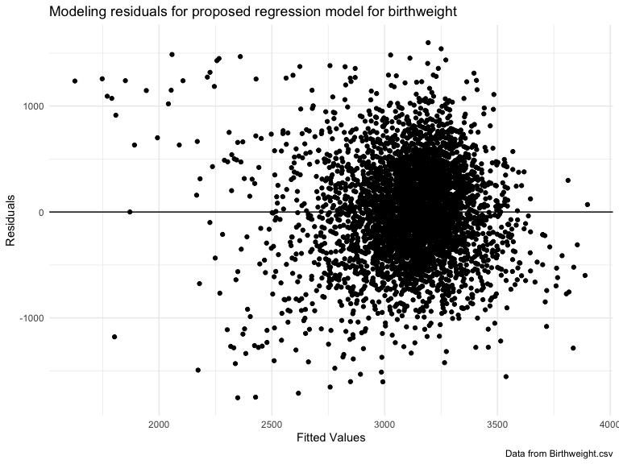

p8105\_hw6\_rac2224
================
Rachel Crowley
11/24/2019

## Problem 1

Loading and cleaning the data for regression analysis

``` r
bwt_data = read_csv("data/birthweight.csv") %>%
  rename(
    baby_sex = babysex,
    baby_head = bhead,
    baby_length = blength,
    birthweight = bwt,
    delivery_weight = delwt,
    family_income = fincome,
    father_race = frace,
    gestational_age = gaweeks,
    malformations = malform,
    menarche_age = menarche,
    mother_height = mheight,
    mother_age = momage, 
    mother_race = mrace,
    previous_low_birthweight = pnumlbw,
    prior_small_for_gestational = pnumsga, 
    pre_pregnancy_bmi = ppbmi,
    pre_pregnancy_weight = ppwt,
    smoking_during_pregnancy = smoken, 
    pregnancy_weight_gain = wtgain
  ) %>%
  mutate(
    baby_sex = as.factor(baby_sex),
    father_race = as.factor(father_race),
    malformations = as.factor(malformations),
    mother_race = as.factor(mother_race) )%>%
  mutate(
    baby_sex = recode(baby_sex, '1' = 'Male', '2' = 'Female'),
    father_race = recode(father_race, '1' = 'White', '2' = 'Black', '3' = 'Asian', '4' = 'Puerto Rican', '8' = 'Other', '9' = 'Unknown'),
    malformations = recode(malformations, '0' = 'Absent', '1' = 'Present'),
    mother_race = recode(mother_race, '1' = 'White', '2' = 'Black', '3' = 'Asian', '4' = 'Puerto Rican', '8' = 'Other')
  ) %>%
  mutate(
    baby_sex = fct_infreq(baby_sex),
    father_race = fct_infreq(father_race),
    malformations = fct_infreq(malformations),
    mother_race = fct_infreq(mother_race)
  )
```

    ## Parsed with column specification:
    ## cols(
    ##   .default = col_double()
    ## )

    ## See spec(...) for full column specifications.

``` r
colSums(is.na(bwt_data))
```

    ##                    baby_sex                   baby_head 
    ##                           0                           0 
    ##                 baby_length                 birthweight 
    ##                           0                           0 
    ##             delivery_weight               family_income 
    ##                           0                           0 
    ##                 father_race             gestational_age 
    ##                           0                           0 
    ##               malformations                menarche_age 
    ##                           0                           0 
    ##               mother_height                  mother_age 
    ##                           0                           0 
    ##                 mother_race                      parity 
    ##                           0                           0 
    ##    previous_low_birthweight prior_small_for_gestational 
    ##                           0                           0 
    ##           pre_pregnancy_bmi        pre_pregnancy_weight 
    ##                           0                           0 
    ##    smoking_during_pregnancy       pregnancy_weight_gain 
    ##                           0                           0

  - baby\_sex, mother\_race, father\_race, and malformations were
    converted from numeric to factor variables. There were no missing
    values across all variables in the
dataset.

<!-- end list -->

``` r
fit = lm(birthweight ~ smoking_during_pregnancy + mother_age + pre_pregnancy_bmi + gestational_age, data = bwt_data)

summary(fit)
```

    ## 
    ## Call:
    ## lm(formula = birthweight ~ smoking_during_pregnancy + mother_age + 
    ##     pre_pregnancy_bmi + gestational_age, data = bwt_data)
    ## 
    ## Residuals:
    ##      Min       1Q   Median       3Q      Max 
    ## -1753.62  -290.47    -4.38   293.48  1598.24 
    ## 
    ## Coefficients:
    ##                          Estimate Std. Error t value Pr(>|t|)    
    ## (Intercept)               52.4635   101.1974   0.518    0.604    
    ## smoking_during_pregnancy  -6.7503     0.9461  -7.135 1.13e-12 ***
    ## mother_age                12.0200     1.8235   6.592 4.87e-11 ***
    ## pre_pregnancy_bmi         12.2664     2.2030   5.568 2.73e-08 ***
    ## gestational_age           65.4725     2.2302  29.357  < 2e-16 ***
    ## ---
    ## Signif. codes:  0 '***' 0.001 '**' 0.01 '*' 0.05 '.' 0.1 ' ' 1
    ## 
    ## Residual standard error: 460.3 on 4337 degrees of freedom
    ## Multiple R-squared:  0.1931, Adjusted R-squared:  0.1924 
    ## F-statistic: 259.5 on 4 and 4337 DF,  p-value: < 2.2e-16

``` r
summary(fit)$coef
```

    ##                           Estimate  Std. Error    t value      Pr(>|t|)
    ## (Intercept)              52.463522 101.1974025  0.5184276  6.041864e-01
    ## smoking_during_pregnancy -6.750317   0.9461156 -7.1347702  1.130899e-12
    ## mother_age               12.019965   1.8235333  6.5915798  4.872476e-11
    ## pre_pregnancy_bmi        12.266396   2.2029542  5.5681576  2.730017e-08
    ## gestational_age          65.472505   2.2302392 29.3567191 6.016702e-173

``` r
coef(fit)
```

    ##              (Intercept) smoking_during_pregnancy               mother_age 
    ##                52.463522                -6.750317                12.019965 
    ##        pre_pregnancy_bmi          gestational_age 
    ##                12.266396                65.472505

``` r
fitted.values(fit)
```

    ##        1        2        3        4        5        6        7        8 
    ## 3419.796 2310.525 3295.705 3088.180 3267.687 3221.812 3214.630 2997.056 
    ##        9       10       11       12       13       14       15       16 
    ## 3091.134 3224.512 3381.358 2981.693 3273.121 3268.431 3133.660 2986.338 
    ##       17       18       19       20       21       22       23       24 
    ## 3342.437 3234.594 3068.377 3086.754 3298.550 3182.096 3066.422 3099.307 
    ##       25       26       27       28       29       30       31       32 
    ## 3231.516 3264.179 3153.660 3014.588 3212.398 3295.321 3103.866 2947.100 
    ##       33       34       35       36       37       38       39       40 
    ## 3109.142 3264.786 3099.973 3277.527 3342.273 3000.455 3122.802 3164.654 
    ##       41       42       43       44       45       46       47       48 
    ## 3245.090 3367.688 3351.792 3367.910 3121.975 3214.352 3333.509 3132.188 
    ##       49       50       51       52       53       54       55       56 
    ## 2920.333 3143.492 3289.935 3098.690 3344.742 3149.181 3200.303 3161.371 
    ##       57       58       59       60       61       62       63       64 
    ## 3267.970 3172.845 3408.033 3262.496 3164.671 2969.886 3200.051 2711.562 
    ##       65       66       67       68       69       70       71       72 
    ## 2998.243 3287.778 3182.414 3176.624 3048.079 3196.303 3168.211 3169.675 
    ##       73       74       75       76       77       78       79       80 
    ## 3236.416 3261.397 3149.631 3194.166 2526.791 3012.233 3206.077 3323.826 
    ##       81       82       83       84       85       86       87       88 
    ## 3058.399 3223.755 3523.347 3201.477 3209.340 2889.854 3718.242 3343.667 
    ##       89       90       91       92       93       94       95       96 
    ## 3246.257 3265.261 3309.166 3238.777 2944.384 3100.053 3000.749 3262.403 
    ##       97       98       99      100      101      102      103      104 
    ## 3239.679 3106.510 3008.078 3223.049 3327.021 3124.926 2991.151 2946.199 
    ##      105      106      107      108      109      110      111      112 
    ## 3255.284 3366.132 3142.220 3192.757 2763.964 2997.429 3293.749 3249.274 
    ##      113      114      115      116      117      118      119      120 
    ## 3261.979 3292.923 2857.730 3167.458 2874.661 3099.082 3222.137 3256.084 
    ##      121      122      123      124      125      126      127      128 
    ## 3210.891 3168.360 2857.086 3172.310 2565.590 2984.904 2870.814 3286.170 
    ##      129      130      131      132      133      134      135      136 
    ## 3284.428 3077.902 2987.246 3253.043 3100.547 3183.874 3517.994 3219.970 
    ##      137      138      139      140      141      142      143      144 
    ## 3318.780 3123.923 3089.798 3118.329 3258.905 3156.131 3202.014 2946.378 
    ##      145      146      147      148      149      150      151      152 
    ## 2846.859 3125.209 3180.390 3196.867 3898.954 3023.814 3216.935 2946.993 
    ##      153      154      155      156      157      158      159      160 
    ## 3289.277 3171.066 3387.590 3207.101 3113.132 3536.840 2317.418 3109.134 
    ##      161      162      163      164      165      166      167      168 
    ## 3386.305 3351.398 2883.888 3430.568 3277.825 3064.876 3249.483 3137.083 
    ##      169      170      171      172      173      174      175      176 
    ## 2859.258 3088.558 3206.565 3130.050 3052.290 3137.634 3343.339 3265.505 
    ##      177      178      179      180      181      182      183      184 
    ## 3078.676 3283.379 3059.189 2983.597 3132.881 3147.143 3101.389 3024.778 
    ##      185      186      187      188      189      190      191      192 
    ## 2982.230 3288.714 3023.933 3153.104 3189.475 3418.527 3334.689 3435.375 
    ##      193      194      195      196      197      198      199      200 
    ## 3061.985 2918.157 3138.106 2989.636 3043.074 3333.053 3247.515 3265.047 
    ##      201      202      203      204      205      206      207      208 
    ## 3195.623 3175.583 3261.245 3218.693 3285.758 3289.840 3246.176 3010.102 
    ##      209      210      211      212      213      214      215      216 
    ## 3178.612 2949.105 3061.305 3273.302 3084.129 3242.974 3254.392 3266.451 
    ##      217      218      219      220      221      222      223      224 
    ## 2967.143 3259.540 2823.690 3222.519 3127.225 3241.850 3211.940 3030.506 
    ##      225      226      227      228      229      230      231      232 
    ## 3169.620 3164.302 3502.101 3198.930 3048.906 3151.860 3077.317 3246.398 
    ##      233      234      235      236      237      238      239      240 
    ## 3277.370 3336.205 3128.313 3158.473 3152.372 3297.396 3445.392 3234.275 
    ##      241      242      243      244      245      246      247      248 
    ## 3125.725 3135.837 3304.864 3231.422 3386.149 3392.742 3160.833 3154.570 
    ##      249      250      251      252      253      254      255      256 
    ## 3202.528 3261.294 3182.241 3188.025 2982.429 3174.477 2901.500 2632.023 
    ##      257      258      259      260      261      262      263      264 
    ## 3202.075 3002.368 3068.592 3170.152 2673.391 3387.841 3339.020 2722.141 
    ##      265      266      267      268      269      270      271      272 
    ## 3068.922 3200.701 3424.182 3129.544 3120.283 3106.352 3193.466 3027.718 
    ##      273      274      275      276      277      278      279      280 
    ## 3533.059 3395.080 3505.794 3233.900 3225.924 3322.827 3007.237 2946.078 
    ##      281      282      283      284      285      286      287      288 
    ## 2797.739 3337.062 3351.043 3311.755 3251.767 3137.065 3253.242 3240.851 
    ##      289      290      291      292      293      294      295      296 
    ## 2926.447 3078.009 3254.499 3276.898 3337.733 3329.938 3088.946 3522.819 
    ##      297      298      299      300      301      302      303      304 
    ## 3171.980 3300.778 3044.517 3085.565 3426.366 3149.436 3281.311 3541.934 
    ##      305      306      307      308      309      310      311      312 
    ## 3105.970 3215.365 3261.570 3134.749 3321.711 3179.886 2987.543 3272.163 
    ##      313      314      315      316      317      318      319      320 
    ## 3299.172 3447.015 2969.738 3049.252 2915.539 3265.440 3173.964 3227.341 
    ##      321      322      323      324      325      326      327      328 
    ## 2971.744 3160.603 3299.088 3700.154 3192.081 3049.553 2935.662 3280.394 
    ##      329      330      331      332      333      334      335      336 
    ## 3262.387 3353.634 3411.381 3231.997 3123.731 3156.936 3176.617 3181.393 
    ##      337      338      339      340      341      342      343      344 
    ## 3242.914 3023.578 3163.961 2785.873 3126.707 3271.745 3214.287 3195.073 
    ##      345      346      347      348      349      350      351      352 
    ## 3099.769 3400.220 3067.895 3193.035 3390.758 2983.228 3081.949 3248.723 
    ##      353      354      355      356      357      358      359      360 
    ## 3296.762 3239.045 3140.554 2510.135 3103.763 3332.127 3140.170 2937.989 
    ##      361      362      363      364      365      366      367      368 
    ## 3082.567 2548.954 3005.354 3197.375 3812.710 3049.315 2700.374 2982.610 
    ##      369      370      371      372      373      374      375      376 
    ## 3011.411 3356.113 3109.471 3111.831 3122.338 3110.770 3150.614 3384.225 
    ##      377      378      379      380      381      382      383      384 
    ## 3230.625 3306.331 3180.853 3108.121 3255.962 3065.388 3072.202 3141.765 
    ##      385      386      387      388      389      390      391      392 
    ## 3201.510 3248.565 3332.572 3243.964 3583.088 3358.694 3224.805 3469.057 
    ##      393      394      395      396      397      398      399      400 
    ## 3091.454 3299.364 3086.094 3150.038 3381.718 3007.339 3381.741 3197.930 
    ##      401      402      403      404      405      406      407      408 
    ## 2900.382 3230.553 3314.621 3218.716 3226.065 3169.748 3258.996 3148.078 
    ##      409      410      411      412      413      414      415      416 
    ## 3139.714 3177.574 3195.499 2853.073 3283.372 3258.266 3139.526 3268.215 
    ##      417      418      419      420      421      422      423      424 
    ## 3239.493 2989.893 3161.278 3161.730 2986.016 3010.702 3204.717 3210.871 
    ##      425      426      427      428      429      430      431      432 
    ## 3003.122 3496.729 3092.140 3278.001 3467.920 3148.853 3147.594 3559.316 
    ##      433      434      435      436      437      438      439      440 
    ## 2742.445 3084.198 3250.634 2929.533 3181.411 3367.027 3215.057 3052.797 
    ##      441      442      443      444      445      446      447      448 
    ## 3062.196 3047.990 2990.822 2963.442 3211.693 2896.928 3282.281 3118.175 
    ##      449      450      451      452      453      454      455      456 
    ## 3134.296 3251.241 3208.991 3192.289 2990.299 3221.152 3272.138 3172.056 
    ##      457      458      459      460      461      462      463      464 
    ## 2980.883 3187.162 3317.061 3055.873 2999.906 2939.124 3177.740 2938.906 
    ##      465      466      467      468      469      470      471      472 
    ## 3168.419 3137.437 3078.354 3266.198 3063.119 3107.593 3131.266 3322.536 
    ##      473      474      475      476      477      478      479      480 
    ## 3128.994 3043.510 2809.850 3284.849 3322.281 3299.701 3286.807 3148.240 
    ##      481      482      483      484      485      486      487      488 
    ## 3093.347 3202.652 2948.375 2970.400 2939.759 3182.504 3219.030 3256.014 
    ##      489      490      491      492      493      494      495      496 
    ## 3366.324 3162.760 3239.981 2972.469 3265.936 3343.927 3246.246 3081.768 
    ##      497      498      499      500      501      502      503      504 
    ## 3390.949 3146.078 3124.237 3143.978 3177.501 3227.856 3319.366 3253.672 
    ##      505      506      507      508      509      510      511      512 
    ## 2780.187 3164.376 3286.430 3488.523 3192.738 3171.090 3127.264 2970.091 
    ##      513      514      515      516      517      518      519      520 
    ## 3126.429 3214.916 3045.977 3229.504 3319.862 3328.041 3161.406 2982.020 
    ##      521      522      523      524      525      526      527      528 
    ## 3279.408 3481.900 3126.221 3241.193 3262.616 3306.065 3215.793 3106.312 
    ##      529      530      531      532      533      534      535      536 
    ## 3335.182 2852.209 3067.252 2972.834 2881.383 3071.442 2986.192 3017.724 
    ##      537      538      539      540      541      542      543      544 
    ## 2976.985 2947.409 2999.663 2877.394 3022.314 2921.121 2944.158 2982.705 
    ##      545      546      547      548      549      550      551      552 
    ## 2956.242 2857.295 3123.455 3064.675 3345.758 3106.820 3241.465 3203.925 
    ##      553      554      555      556      557      558      559      560 
    ## 3205.790 3457.097 3136.399 3371.625 3448.846 2683.323 3024.479 3137.786 
    ##      561      562      563      564      565      566      567      568 
    ## 3006.481 2744.561 3108.060 3102.640 3110.342 3119.602 3394.527 3256.037 
    ##      569      570      571      572      573      574      575      576 
    ## 3294.609 3138.232 3020.575 3399.013 2985.076 3088.235 3258.139 3391.675 
    ##      577      578      579      580      581      582      583      584 
    ## 3270.873 3171.178 2968.702 3544.701 3049.639 3336.700 3191.915 3246.636 
    ##      585      586      587      588      589      590      591      592 
    ## 3294.362 2995.382 3260.590 3075.263 3494.944 3323.415 3286.449 3055.280 
    ##      593      594      595      596      597      598      599      600 
    ## 3024.390 3429.737 3344.924 3154.278 3225.094 3320.798 3183.515 3261.062 
    ##      601      602      603      604      605      606      607      608 
    ## 3268.658 3130.995 3227.449 2966.540 3191.112 3134.499 2891.159 3275.439 
    ##      609      610      611      612      613      614      615      616 
    ## 2635.887 2877.017 3183.998 3181.641 3161.718 3161.405 2923.262 3041.098 
    ##      617      618      619      620      621      622      623      624 
    ## 3303.151 3531.827 3280.024 3096.991 3104.618 3186.448 2959.497 3349.650 
    ##      625      626      627      628      629      630      631      632 
    ## 3259.695 2927.982 3033.623 3142.216 3046.070 3266.895 3128.624 3153.730 
    ##      633      634      635      636      637      638      639      640 
    ## 3261.970 3161.990 2903.171 3224.362 3060.023 3513.808 3118.684 3021.567 
    ##      641      642      643      644      645      646      647      648 
    ## 3126.758 2998.488 3527.153 3250.662 3256.780 3244.274 3136.161 2901.317 
    ##      649      650      651      652      653      654      655      656 
    ## 3227.437 3174.347 3216.780 3328.586 3093.751 3270.297 3359.345 3101.801 
    ##      657      658      659      660      661      662      663      664 
    ## 3079.331 3037.514 3141.693 3248.855 3051.251 3177.317 2959.530 2719.811 
    ##      665      666      667      668      669      670      671      672 
    ## 3185.341 2849.746 3114.006 3266.834 3257.804 2979.432 3570.086 3197.848 
    ##      673      674      675      676      677      678      679      680 
    ## 3114.159 3112.489 3046.831 3069.888 3105.456 3216.867 3021.003 3237.395 
    ##      681      682      683      684      685      686      687      688 
    ## 3028.319 3244.873 3024.526 3222.690 3116.513 3079.790 3258.343 3082.180 
    ##      689      690      691      692      693      694      695      696 
    ## 3162.293 3310.899 3109.102 2969.506 3219.618 3195.403 3224.584 3099.158 
    ##      697      698      699      700      701      702      703      704 
    ## 3365.938 2705.952 3179.461 3224.120 2989.330 3282.235 3121.500 3219.910 
    ##      705      706      707      708      709      710      711      712 
    ## 3146.675 3108.618 3104.498 3180.284 3113.638 3006.517 3222.880 3061.262 
    ##      713      714      715      716      717      718      719      720 
    ## 2934.229 3178.722 3089.761 3219.877 3130.465 3786.393 2801.821 2914.617 
    ##      721      722      723      724      725      726      727      728 
    ## 3230.127 3096.650 3086.068 3090.471 3336.867 2842.673 3139.409 2987.110 
    ##      729      730      731      732      733      734      735      736 
    ## 3038.373 3235.603 2225.327 3003.553 3318.448 3199.036 3099.445 3065.905 
    ##      737      738      739      740      741      742      743      744 
    ## 3287.742 3334.955 3174.437 3274.546 2962.249 3297.454 2981.644 3184.702 
    ##      745      746      747      748      749      750      751      752 
    ## 3184.595 3462.431 3089.773 3352.682 3094.680 3137.954 2908.241 3274.674 
    ##      753      754      755      756      757      758      759      760 
    ## 2986.756 3150.335 3412.868 3316.614 3546.199 3410.601 3035.099 3151.681 
    ##      761      762      763      764      765      766      767      768 
    ## 3299.832 3204.237 3090.801 2774.237 3218.619 3314.270 3097.217 3328.967 
    ##      769      770      771      772      773      774      775      776 
    ## 2892.057 3148.123 3222.969 2944.313 3494.938 3242.710 3330.583 3016.007 
    ##      777      778      779      780      781      782      783      784 
    ## 3082.752 3171.180 3246.847 3205.443 3119.049 3067.335 3027.268 2989.220 
    ##      785      786      787      788      789      790      791      792 
    ## 3183.340 3229.976 3241.850 3083.768 3001.514 3102.963 3374.155 3171.978 
    ##      793      794      795      796      797      798      799      800 
    ## 3324.000 2528.987 3065.764 3360.252 3015.966 3351.019 3242.780 3140.156 
    ##      801      802      803      804      805      806      807      808 
    ## 2935.949 3221.396 3339.043 3154.287 3447.601 3129.767 2865.212 3276.538 
    ##      809      810      811      812      813      814      815      816 
    ## 3226.624 3277.303 3145.127 3304.234 3224.178 3024.849 2676.494 2905.400 
    ##      817      818      819      820      821      822      823      824 
    ## 3100.285 3083.696 3213.993 3331.152 3014.074 2863.539 3227.451 3175.220 
    ##      825      826      827      828      829      830      831      832 
    ## 2767.369 2910.132 2752.430 2248.754 3376.495 3082.436 3170.810 3054.500 
    ##      833      834      835      836      837      838      839      840 
    ## 3123.033 3225.350 3477.184 2959.221 3346.310 3197.720 3146.237 3178.106 
    ##      841      842      843      844      845      846      847      848 
    ## 3131.704 3284.077 3295.982 2754.988 3307.062 3269.890 2817.901 2769.950 
    ##      849      850      851      852      853      854      855      856 
    ## 2965.036 3246.192 3260.014 3189.410 2985.470 3130.337 3266.617 3183.001 
    ##      857      858      859      860      861      862      863      864 
    ## 2999.852 3317.182 3083.558 3190.367 3390.345 3190.760 3284.591 2540.475 
    ##      865      866      867      868      869      870      871      872 
    ## 3189.833 3133.893 2897.542 3113.041 3267.083 3357.174 3193.065 3287.667 
    ##      873      874      875      876      877      878      879      880 
    ## 3338.786 2835.773 3215.481 2981.496 2936.918 3443.361 3032.088 3230.966 
    ##      881      882      883      884      885      886      887      888 
    ## 3136.337 2795.978 3243.774 3078.330 2790.796 3141.491 3271.062 3153.997 
    ##      889      890      891      892      893      894      895      896 
    ## 2868.835 2951.907 3214.346 3209.463 3095.481 3233.666 3335.518 3322.536 
    ##      897      898      899      900      901      902      903      904 
    ## 3097.423 3320.025 2951.964 3285.463 3305.291 3133.691 3085.682 3301.993 
    ##      905      906      907      908      909      910      911      912 
    ## 3393.233 3078.614 3068.585 3273.370 3176.616 3156.389 3189.698 3202.664 
    ##      913      914      915      916      917      918      919      920 
    ## 3235.291 3047.669 3206.227 3162.350 3174.790 3212.204 3110.325 2693.251 
    ##      921      922      923      924      925      926      927      928 
    ## 3522.509 3273.735 3157.762 3376.179 3325.268 3211.685 3159.003 3133.722 
    ##      929      930      931      932      933      934      935      936 
    ## 3018.433 3358.839 3062.956 3174.080 3159.092 3337.867 3087.183 3090.228 
    ##      937      938      939      940      941      942      943      944 
    ## 2752.915 3198.184 2988.496 3315.012 3188.110 3163.301 3328.084 3216.854 
    ##      945      946      947      948      949      950      951      952 
    ## 3312.627 3165.194 3259.822 2801.600 3185.352 3265.296 3394.401 3009.139 
    ##      953      954      955      956      957      958      959      960 
    ## 3255.641 3068.479 3191.838 2963.836 3308.780 3099.761 3002.715 3080.463 
    ##      961      962      963      964      965      966      967      968 
    ## 3218.675 3150.340 3132.178 3334.009 3193.379 3132.666 3236.140 3204.797 
    ##      969      970      971      972      973      974      975      976 
    ## 3088.337 3125.780 2861.280 3232.252 3288.623 3004.516 3132.529 3191.644 
    ##      977      978      979      980      981      982      983      984 
    ## 3170.823 3297.538 3182.392 3309.389 3319.151 3624.608 3218.885 3287.135 
    ##      985      986      987      988      989      990      991      992 
    ## 3414.048 3372.674 3058.038 3109.588 3426.612 3166.638 3146.801 3100.063 
    ##      993      994      995      996      997      998      999     1000 
    ## 3437.276 3132.590 3173.949 3381.875 3199.248 3221.592 3157.278 3348.542 
    ##     1001     1002     1003     1004     1005     1006     1007     1008 
    ## 3349.694 3083.691 3302.968 3120.865 3261.012 3247.161 3193.407 3032.426 
    ##     1009     1010     1011     1012     1013     1014     1015     1016 
    ## 3353.081 3315.472 3481.554 3081.723 3465.501 3091.287 3057.330 3151.735 
    ##     1017     1018     1019     1020     1021     1022     1023     1024 
    ## 3412.189 3110.833 3275.964 3122.958 3180.429 3324.547 3334.874 2725.479 
    ##     1025     1026     1027     1028     1029     1030     1031     1032 
    ## 3349.253 3479.965 3022.676 3096.586 3308.371 2919.165 3468.624 3151.192 
    ##     1033     1034     1035     1036     1037     1038     1039     1040 
    ## 3402.435 3204.717 3154.507 3302.876 3222.158 3114.238 3204.366 3310.348 
    ##     1041     1042     1043     1044     1045     1046     1047     1048 
    ## 3326.677 3269.934 3431.511 3229.559 3357.517 3192.942 3148.786 3099.852 
    ##     1049     1050     1051     1052     1053     1054     1055     1056 
    ## 3219.170 3224.924 3343.334 3236.366 3095.225 3130.226 3237.218 3362.898 
    ##     1057     1058     1059     1060     1061     1062     1063     1064 
    ## 3209.709 3179.283 3290.657 3268.461 3469.574 3240.550 3242.013 3217.201 
    ##     1065     1066     1067     1068     1069     1070     1071     1072 
    ## 3193.455 3060.064 3274.926 3178.032 3196.705 3205.310 3343.259 3225.537 
    ##     1073     1074     1075     1076     1077     1078     1079     1080 
    ## 3153.765 3158.255 3347.390 3264.946 3068.927 2928.265 3231.981 3051.277 
    ##     1081     1082     1083     1084     1085     1086     1087     1088 
    ## 3212.913 2830.307 3167.895 3027.849 3283.184 3206.774 3076.352 3213.244 
    ##     1089     1090     1091     1092     1093     1094     1095     1096 
    ## 3166.756 3206.271 3223.268 3246.281 3215.352 3289.336 2963.804 3162.174 
    ##     1097     1098     1099     1100     1101     1102     1103     1104 
    ## 3148.493 2916.158 3046.497 2773.767 3288.058 3019.097 3060.939 3202.034 
    ##     1105     1106     1107     1108     1109     1110     1111     1112 
    ## 3165.712 3101.599 3022.776 3269.888 3182.943 3263.939 3130.122 3435.538 
    ##     1113     1114     1115     1116     1117     1118     1119     1120 
    ## 3169.774 2957.898 3200.898 3187.606 3182.473 3304.382 3185.144 3108.674 
    ##     1121     1122     1123     1124     1125     1126     1127     1128 
    ## 2996.361 3092.133 3163.680 3294.233 3258.170 3264.250 3121.737 2721.439 
    ##     1129     1130     1131     1132     1133     1134     1135     1136 
    ## 3567.787 3254.976 3328.324 3245.860 3490.202 3186.075 3107.586 3282.255 
    ##     1137     1138     1139     1140     1141     1142     1143     1144 
    ## 3132.217 3111.044 3124.189 3215.663 3086.344 3336.206 2973.200 3068.985 
    ##     1145     1146     1147     1148     1149     1150     1151     1152 
    ## 3232.681 3285.532 3124.138 3270.926 3092.631 2992.148 3112.615 3292.459 
    ##     1153     1154     1155     1156     1157     1158     1159     1160 
    ## 3278.291 3314.653 3137.968 3015.138 3190.244 2958.809 3239.586 2964.230 
    ##     1161     1162     1163     1164     1165     1166     1167     1168 
    ## 3084.567 3132.601 3232.573 3390.971 3228.160 3342.078 3211.008 3029.153 
    ##     1169     1170     1171     1172     1173     1174     1175     1176 
    ## 3385.538 3297.387 3587.670 3360.740 3257.790 3414.136 3376.946 3364.496 
    ##     1177     1178     1179     1180     1181     1182     1183     1184 
    ## 3194.990 2920.225 3029.802 3141.451 3164.178 3248.971 3287.779 3339.071 
    ##     1185     1186     1187     1188     1189     1190     1191     1192 
    ## 3284.384 3238.703 3144.634 3248.515 3256.872 3059.404 3516.037 3321.669 
    ##     1193     1194     1195     1196     1197     1198     1199     1200 
    ## 3013.415 3095.626 3224.262 3091.046 3258.615 3091.846 3058.349 3138.338 
    ##     1201     1202     1203     1204     1205     1206     1207     1208 
    ## 3365.293 3236.432 3161.254 3174.477 3215.632 3290.501 2932.790 3302.726 
    ##     1209     1210     1211     1212     1213     1214     1215     1216 
    ## 3231.968 3331.049 3025.660 3365.652 2948.732 2838.381 3167.903 3243.758 
    ##     1217     1218     1219     1220     1221     1222     1223     1224 
    ## 2975.470 3223.912 3363.831 2824.624 3150.278 3348.755 3103.868 2905.852 
    ##     1225     1226     1227     1228     1229     1230     1231     1232 
    ## 3055.843 3148.718 3320.492 2963.830 3242.151 3542.465 3271.909 3220.236 
    ##     1233     1234     1235     1236     1237     1238     1239     1240 
    ## 3233.018 3124.127 3274.781 3243.239 3211.265 3117.992 2957.013 3270.073 
    ##     1241     1242     1243     1244     1245     1246     1247     1248 
    ## 3283.583 3132.585 3269.671 3190.209 3269.793 3175.123 3130.337 3259.168 
    ##     1249     1250     1251     1252     1253     1254     1255     1256 
    ## 3500.460 3317.954 3217.728 2968.445 3049.040 3396.127 3218.754 3181.041 
    ##     1257     1258     1259     1260     1261     1262     1263     1264 
    ## 3137.425 3050.832 3247.479 3191.936 3233.883 3358.586 3165.606 3164.044 
    ##     1265     1266     1267     1268     1269     1270     1271     1272 
    ## 3278.236 3471.410 3156.736 3112.777 3291.970 3312.043 3296.134 3220.705 
    ##     1273     1274     1275     1276     1277     1278     1279     1280 
    ## 3270.511 2920.161 3250.471 3081.423 2822.656 3137.077 2870.172 3447.932 
    ##     1281     1282     1283     1284     1285     1286     1287     1288 
    ## 3318.814 3207.258 3249.453 2985.771 3401.480 3203.054 3254.483 3169.393 
    ##     1289     1290     1291     1292     1293     1294     1295     1296 
    ## 3213.530 2874.817 2905.710 2849.422 3202.398 3257.677 2814.919 2761.981 
    ##     1297     1298     1299     1300     1301     1302     1303     1304 
    ## 2997.170 3175.264 2614.348 3265.177 3284.958 3206.317 3151.953 2321.405 
    ##     1305     1306     1307     1308     1309     1310     1311     1312 
    ## 2571.052 3239.573 3113.077 2902.034 3624.716 3145.492 2871.159 2981.659 
    ##     1313     1314     1315     1316     1317     1318     1319     1320 
    ## 3045.704 3092.934 3202.728 2908.032 2823.322 3230.896 3161.061 2379.106 
    ##     1321     1322     1323     1324     1325     1326     1327     1328 
    ## 3254.915 3272.856 3025.598 3119.584 3084.534 3381.705 3447.392 3027.362 
    ##     1329     1330     1331     1332     1333     1334     1335     1336 
    ## 2873.033 3212.137 3108.666 2953.971 2719.115 3195.985 2954.023 3131.420 
    ##     1337     1338     1339     1340     1341     1342     1343     1344 
    ## 2875.977 2955.374 3057.257 3152.495 3198.641 2999.562 2269.291 2786.979 
    ##     1345     1346     1347     1348     1349     1350     1351     1352 
    ## 3108.731 2950.350 2971.911 3211.385 3268.705 3014.205 2997.370 3013.907 
    ##     1353     1354     1355     1356     1357     1358     1359     1360 
    ## 3155.958 2916.565 2893.176 3078.140 2985.069 3606.669 3143.030 3019.574 
    ##     1361     1362     1363     1364     1365     1366     1367     1368 
    ## 3153.986 2828.090 3147.479 2779.117 2703.958 3168.356 3128.785 3021.283 
    ##     1369     1370     1371     1372     1373     1374     1375     1376 
    ## 3072.090 3137.039 3333.742 2958.619 3064.578 2734.177 3043.896 2997.998 
    ##     1377     1378     1379     1380     1381     1382     1383     1384 
    ## 3050.656 3096.869 2690.920 2575.030 3010.524 2857.711 2944.699 3224.431 
    ##     1385     1386     1387     1388     1389     1390     1391     1392 
    ## 3041.030 2873.716 3036.515 3567.148 3157.319 3220.854 3174.014 3068.511 
    ##     1393     1394     1395     1396     1397     1398     1399     1400 
    ## 3119.503 2798.806 3037.864 3297.379 3172.967 2917.682 3121.810 2497.547 
    ##     1401     1402     1403     1404     1405     1406     1407     1408 
    ## 2792.817 3044.854 1626.888 2723.967 3046.312 3350.256 2858.785 3541.656 
    ##     1409     1410     1411     1412     1413     1414     1415     1416 
    ## 2980.075 3094.475 3160.954 2866.359 2699.320 2722.345 3207.559 3097.338 
    ##     1417     1418     1419     1420     1421     1422     1423     1424 
    ## 3343.940 2917.932 3170.124 3252.375 3087.172 3128.164 2783.301 2732.332 
    ##     1425     1426     1427     1428     1429     1430     1431     1432 
    ## 3261.369 2450.641 2933.610 3215.874 3091.569 3430.547 2779.129 3120.799 
    ##     1433     1434     1435     1436     1437     1438     1439     1440 
    ## 3290.346 3249.008 3128.938 3449.954 3118.159 2962.794 3211.058 3167.139 
    ##     1441     1442     1443     1444     1445     1446     1447     1448 
    ## 2900.017 3118.254 3362.379 2392.124 3220.323 3254.508 2881.156 2868.676 
    ##     1449     1450     1451     1452     1453     1454     1455     1456 
    ## 2997.042 3101.244 2814.230 3280.256 2923.763 2964.553 3294.890 2860.953 
    ##     1457     1458     1459     1460     1461     1462     1463     1464 
    ## 3067.993 3088.552 3034.935 3134.437 3233.171 3212.472 3512.035 3299.391 
    ##     1465     1466     1467     1468     1469     1470     1471     1472 
    ## 3288.009 3050.579 3805.389 3176.078 2959.011 3193.955 3171.781 3070.339 
    ##     1473     1474     1475     1476     1477     1478     1479     1480 
    ## 3497.543 2940.569 2841.889 3248.675 3086.415 2762.959 2964.233 2974.522 
    ##     1481     1482     1483     1484     1485     1486     1487     1488 
    ## 3233.126 3148.832 3286.450 2452.904 3137.401 3056.263 3368.340 3285.207 
    ##     1489     1490     1491     1492     1493     1494     1495     1496 
    ## 3015.408 2758.593 2900.102 3117.487 3115.906 3161.783 3153.414 3550.046 
    ##     1497     1498     1499     1500     1501     1502     1503     1504 
    ## 2890.450 3223.110 2920.273 2898.072 3144.826 2859.123 2698.039 2389.515 
    ##     1505     1506     1507     1508     1509     1510     1511     1512 
    ## 3471.799 2965.194 2905.925 2855.967 2790.008 3296.412 2989.631 3169.681 
    ##     1513     1514     1515     1516     1517     1518     1519     1520 
    ## 3006.418 3073.562 3227.470 3135.789 3284.141 2784.987 2790.128 3218.982 
    ##     1521     1522     1523     1524     1525     1526     1527     1528 
    ## 2757.575 2940.097 3158.448 3056.591 2738.162 3427.938 3112.378 3179.677 
    ##     1529     1530     1531     1532     1533     1534     1535     1536 
    ## 2853.489 2961.701 3091.724 3221.493 3201.739 2850.274 3085.344 3244.064 
    ##     1537     1538     1539     1540     1541     1542     1543     1544 
    ## 2734.149 3259.956 3212.879 2971.213 3093.576 2289.600 2648.696 3189.755 
    ##     1545     1546     1547     1548     1549     1550     1551     1552 
    ## 2958.155 3134.845 3232.414 3192.426 3209.995 3010.625 3317.013 3127.050 
    ##     1553     1554     1555     1556     1557     1558     1559     1560 
    ## 2894.631 2981.831 3135.851 3147.123 2850.885 1992.784 2908.402 3378.403 
    ##     1561     1562     1563     1564     1565     1566     1567     1568 
    ## 3112.807 3361.089 2980.167 2930.778 3055.998 2966.204 3215.610 2989.385 
    ##     1569     1570     1571     1572     1573     1574     1575     1576 
    ## 3027.642 3096.083 2924.037 3397.599 3001.724 3082.487 2758.906 3440.469 
    ##     1577     1578     1579     1580     1581     1582     1583     1584 
    ## 3513.691 3223.240 3534.500 2823.877 2657.976 3017.388 3157.781 2987.876 
    ##     1585     1586     1587     1588     1589     1590     1591     1592 
    ## 3190.336 3063.900 3260.868 3033.667 3102.286 3403.840 3441.451 3023.543 
    ##     1593     1594     1595     1596     1597     1598     1599     1600 
    ## 3254.565 3411.348 3265.418 2858.149 2990.600 2053.687 3104.414 2878.749 
    ##     1601     1602     1603     1604     1605     1606     1607     1608 
    ## 3019.220 2794.003 3139.445 2875.064 3762.025 2564.136 3189.693 3131.347 
    ##     1609     1610     1611     1612     1613     1614     1615     1616 
    ## 2802.003 3162.906 2726.188 3211.057 3402.783 2919.931 3077.243 3114.061 
    ##     1617     1618     1619     1620     1621     1622     1623     1624 
    ## 3098.307 3095.247 3326.061 3217.303 3566.368 2623.377 3162.787 3037.207 
    ##     1625     1626     1627     1628     1629     1630     1631     1632 
    ## 3443.737 2979.976 3087.087 2967.540 2855.647 3118.819 3097.296 3122.228 
    ##     1633     1634     1635     1636     1637     1638     1639     1640 
    ## 3165.216 3272.333 3052.999 2967.897 3347.000 3210.700 2429.909 3139.608 
    ##     1641     1642     1643     1644     1645     1646     1647     1648 
    ## 3225.348 3544.055 3011.130 3759.744 3073.789 3563.607 3271.824 3273.290 
    ##     1649     1650     1651     1652     1653     1654     1655     1656 
    ## 2971.722 2519.440 2859.858 2839.997 2838.878 3168.614 2988.270 3235.864 
    ##     1657     1658     1659     1660     1661     1662     1663     1664 
    ## 3321.307 2919.991 3152.669 3003.422 3182.890 2951.743 3183.117 3289.972 
    ##     1665     1666     1667     1668     1669     1670     1671     1672 
    ## 3235.403 3149.005 3016.848 3461.108 2844.069 3150.105 3324.532 2879.353 
    ##     1673     1674     1675     1676     1677     1678     1679     1680 
    ## 2926.450 2739.878 2782.915 3149.378 3387.858 3147.871 3176.887 2890.538 
    ##     1681     1682     1683     1684     1685     1686     1687     1688 
    ## 2302.240 3394.380 3242.628 3256.146 3339.577 2753.780 3059.072 3087.677 
    ##     1689     1690     1691     1692     1693     1694     1695     1696 
    ## 3095.125 3452.252 2804.160 3218.735 3397.629 3060.329 3034.605 3146.830 
    ##     1697     1698     1699     1700     1701     1702     1703     1704 
    ## 2835.764 3103.343 3493.661 3217.096 3063.751 3096.952 3290.085 3154.041 
    ##     1705     1706     1707     1708     1709     1710     1711     1712 
    ## 3024.454 3323.245 3200.619 3000.891 3148.957 2649.313 3073.317 2979.252 
    ##     1713     1714     1715     1716     1717     1718     1719     1720 
    ## 3057.338 3235.392 3074.236 3052.972 2969.994 2909.775 2925.300 3224.078 
    ##     1721     1722     1723     1724     1725     1726     1727     1728 
    ## 2689.945 3253.117 3316.977 3121.142 3120.981 2706.690 2994.515 2980.398 
    ##     1729     1730     1731     1732     1733     1734     1735     1736 
    ## 3056.249 3206.934 3145.511 3195.428 3057.415 3162.772 3155.639 3344.548 
    ##     1737     1738     1739     1740     1741     1742     1743     1744 
    ## 3263.552 3289.334 2759.869 2895.871 3078.858 3220.697 2768.152 3152.412 
    ##     1745     1746     1747     1748     1749     1750     1751     1752 
    ## 2836.298 3157.940 2955.704 2427.785 3299.990 3051.877 2932.973 3162.446 
    ##     1753     1754     1755     1756     1757     1758     1759     1760 
    ## 2710.511 2631.001 3188.097 3301.036 3041.079 3157.332 2759.707 2889.781 
    ##     1761     1762     1763     1764     1765     1766     1767     1768 
    ## 3099.163 2962.041 3098.883 3117.766 2987.284 3270.689 3129.067 3636.926 
    ##     1769     1770     1771     1772     1773     1774     1775     1776 
    ## 2744.068 3176.364 3140.307 3372.406 3364.941 2788.365 2371.718 3093.950 
    ##     1777     1778     1779     1780     1781     1782     1783     1784 
    ## 3130.973 2782.199 3234.893 3253.815 3516.852 3215.049 3120.623 3018.156 
    ##     1785     1786     1787     1788     1789     1790     1791     1792 
    ## 3168.827 2831.312 2930.315 3066.607 3025.213 3196.946 2924.551 3079.100 
    ##     1793     1794     1795     1796     1797     1798     1799     1800 
    ## 3052.548 2905.005 2880.251 3058.518 3043.728 3025.872 3181.346 3428.089 
    ##     1801     1802     1803     1804     1805     1806     1807     1808 
    ## 3063.172 3107.483 2768.761 3183.118 3274.329 3336.568 2923.524 2922.440 
    ##     1809     1810     1811     1812     1813     1814     1815     1816 
    ## 2952.348 3141.461 2281.471 2759.697 2580.398 3281.719 3169.002 3158.896 
    ##     1817     1818     1819     1820     1821     1822     1823     1824 
    ## 3142.241 3035.016 2666.463 3062.537 3253.616 2809.717 2858.655 2957.365 
    ##     1825     1826     1827     1828     1829     1830     1831     1832 
    ## 3097.006 2967.445 3084.352 3340.837 3154.862 2892.579 3155.723 3292.099 
    ##     1833     1834     1835     1836     1837     1838     1839     1840 
    ## 3178.819 3095.288 3071.992 2824.270 3101.643 3155.662 3239.644 2619.374 
    ##     1841     1842     1843     1844     1845     1846     1847     1848 
    ## 2983.442 3168.621 2816.190 2972.806 3124.761 3435.506 3184.865 3176.644 
    ##     1849     1850     1851     1852     1853     1854     1855     1856 
    ## 3410.941 3146.803 3283.562 3247.961 3104.182 2933.252 3253.292 3524.017 
    ##     1857     1858     1859     1860     1861     1862     1863     1864 
    ## 3061.142 2853.717 2509.984 3043.654 3192.547 3049.468 2735.553 3274.289 
    ##     1865     1866     1867     1868     1869     1870     1871     1872 
    ## 3113.391 3126.101 3281.900 3071.523 3294.556 3226.571 3223.853 3244.901 
    ##     1873     1874     1875     1876     1877     1878     1879     1880 
    ## 2953.267 2994.221 3164.341 3098.711 3159.782 3332.289 3072.311 3016.295 
    ##     1881     1882     1883     1884     1885     1886     1887     1888 
    ## 3250.743 2745.530 3291.225 2371.192 3244.912 2964.125 3024.861 2976.231 
    ##     1889     1890     1891     1892     1893     1894     1895     1896 
    ## 2819.709 2778.988 3154.531 3105.927 2964.154 3289.352 3285.966 3144.604 
    ##     1897     1898     1899     1900     1901     1902     1903     1904 
    ## 3264.411 2869.558 2795.237 3101.153 3169.717 3057.515 3146.373 3057.150 
    ##     1905     1906     1907     1908     1909     1910     1911     1912 
    ## 3142.197 3029.019 2826.054 3354.296 3151.248 3084.269 3249.643 2613.247 
    ##     1913     1914     1915     1916     1917     1918     1919     1920 
    ## 3136.313 3618.031 3012.758 3466.491 2964.100 3177.425 3345.095 3074.480 
    ##     1921     1922     1923     1924     1925     1926     1927     1928 
    ## 2844.427 2856.428 3092.073 3544.963 3414.720 3149.408 3312.573 3191.609 
    ##     1929     1930     1931     1932     1933     1934     1935     1936 
    ## 3231.829 3163.056 3051.957 2756.116 2949.075 3057.323 3185.303 3110.790 
    ##     1937     1938     1939     1940     1941     1942     1943     1944 
    ## 3176.609 3085.005 3307.887 3137.252 3234.265 3409.118 2889.162 3021.210 
    ##     1945     1946     1947     1948     1949     1950     1951     1952 
    ## 3177.790 2912.010 3133.356 2894.999 2993.272 3118.379 3082.201 3088.319 
    ##     1953     1954     1955     1956     1957     1958     1959     1960 
    ## 3166.867 3229.070 3278.896 3399.671 3530.434 3117.354 3104.393 3291.746 
    ##     1961     1962     1963     1964     1965     1966     1967     1968 
    ## 2677.950 3310.348 2883.409 3140.435 3101.829 2827.423 2996.203 3333.499 
    ##     1969     1970     1971     1972     1973     1974     1975     1976 
    ## 2970.303 2923.665 3347.510 3058.939 3117.730 2571.563 3357.118 3211.415 
    ##     1977     1978     1979     1980     1981     1982     1983     1984 
    ## 3200.038 3078.006 3014.176 2760.762 3115.581 3129.445 3261.626 3247.166 
    ##     1985     1986     1987     1988     1989     1990     1991     1992 
    ## 3023.262 3077.560 3231.145 3020.479 3314.619 2497.266 3599.824 3237.042 
    ##     1993     1994     1995     1996     1997     1998     1999     2000 
    ## 1891.070 3246.931 2622.833 3308.902 2830.122 2984.965 3029.176 3097.833 
    ##     2001     2002     2003     2004     2005     2006     2007     2008 
    ## 3172.099 3008.932 3183.174 3182.533 3362.038 2964.792 3182.081 3211.834 
    ##     2009     2010     2011     2012     2013     2014     2015     2016 
    ## 2810.323 3029.315 2792.782 3016.312 3328.993 3109.716 2938.443 2778.933 
    ##     2017     2018     2019     2020     2021     2022     2023     2024 
    ## 2861.401 2837.026 2514.669 2915.798 2918.789 2669.362 2911.542 2607.742 
    ##     2025     2026     2027     2028     2029     2030     2031     2032 
    ## 3126.844 3206.075 2446.340 2958.400 3111.865 3192.989 3195.596 3073.822 
    ##     2033     2034     2035     2036     2037     2038     2039     2040 
    ## 2815.022 3150.206 2754.125 3043.960 2732.521 2750.983 3062.385 3557.278 
    ##     2041     2042     2043     2044     2045     2046     2047     2048 
    ## 3167.103 2505.516 3196.694 2978.348 2795.522 3268.527 2984.803 3203.631 
    ##     2049     2050     2051     2052     2053     2054     2055     2056 
    ## 3160.584 3213.903 3231.677 3043.094 3521.098 3136.111 3059.913 3220.784 
    ##     2057     2058     2059     2060     2061     2062     2063     2064 
    ## 3063.809 3365.790 3245.091 3358.453 3069.508 3181.944 3326.617 3108.785 
    ##     2065     2066     2067     2068     2069     2070     2071     2072 
    ## 3255.909 3191.321 3250.651 3186.299 3087.617 3037.103 3250.390 3350.028 
    ##     2073     2074     2075     2076     2077     2078     2079     2080 
    ## 3143.261 2961.754 3201.392 3184.304 2948.483 3037.193 3371.721 2873.419 
    ##     2081     2082     2083     2084     2085     2086     2087     2088 
    ## 2866.721 3015.474 3204.836 3281.054 2871.750 3064.361 3167.532 3151.251 
    ##     2089     2090     2091     2092     2093     2094     2095     2096 
    ## 3275.189 3219.198 3161.910 3280.935 3033.949 2997.736 3157.228 3062.031 
    ##     2097     2098     2099     2100     2101     2102     2103     2104 
    ## 2910.452 3098.373 3272.112 3355.461 3215.888 3084.587 3127.225 3302.173 
    ##     2105     2106     2107     2108     2109     2110     2111     2112 
    ## 3099.645 3319.343 3096.178 3193.671 3215.807 2953.390 2941.680 3145.511 
    ##     2113     2114     2115     2116     2117     2118     2119     2120 
    ## 3046.211 2921.380 3293.108 3271.167 3228.228 3311.395 3262.664 3198.060 
    ##     2121     2122     2123     2124     2125     2126     2127     2128 
    ## 2927.049 3106.269 3421.223 3342.903 3111.090 3198.426 3283.432 3163.968 
    ##     2129     2130     2131     2132     2133     2134     2135     2136 
    ## 3498.354 2467.258 3246.976 3169.428 3280.754 3268.654 3249.910 3245.001 
    ##     2137     2138     2139     2140     2141     2142     2143     2144 
    ## 3308.372 3137.678 3006.511 3381.432 3144.310 3186.780 3372.589 3062.212 
    ##     2145     2146     2147     2148     2149     2150     2151     2152 
    ## 3155.820 3217.612 3205.592 3112.221 3225.678 3191.294 2881.583 3205.261 
    ##     2153     2154     2155     2156     2157     2158     2159     2160 
    ## 3194.991 3367.903 3249.323 3241.241 2853.659 3107.088 3156.936 2895.452 
    ##     2161     2162     2163     2164     2165     2166     2167     2168 
    ## 3263.335 3100.418 3024.493 3273.891 3038.856 3221.686 3162.212 3366.266 
    ##     2169     2170     2171     2172     2173     2174     2175     2176 
    ## 3244.319 3223.003 3003.616 3169.014 3009.954 3029.262 3239.532 3093.135 
    ##     2177     2178     2179     2180     2181     2182     2183     2184 
    ## 3097.669 3133.312 3853.959 2954.137 3235.321 3225.745 3276.517 3220.919 
    ##     2185     2186     2187     2188     2189     2190     2191     2192 
    ## 3090.266 3241.985 3172.354 3121.988 2959.279 3154.118 3154.246 3268.240 
    ##     2193     2194     2195     2196     2197     2198     2199     2200 
    ## 3086.451 3155.083 3212.530 3060.569 3535.899 3396.278 3133.440 3309.176 
    ##     2201     2202     2203     2204     2205     2206     2207     2208 
    ## 3357.093 3132.309 3130.446 3162.129 3038.826 3083.826 2951.008 3135.076 
    ##     2209     2210     2211     2212     2213     2214     2215     2216 
    ## 3350.691 3197.279 3393.049 3174.203 3292.155 2890.931 3358.312 3236.350 
    ##     2217     2218     2219     2220     2221     2222     2223     2224 
    ## 3379.214 3144.953 3145.043 2964.290 3190.233 3161.374 3198.345 3097.531 
    ##     2225     2226     2227     2228     2229     2230     2231     2232 
    ## 3013.562 2838.093 2944.638 2343.519 3139.428 3179.903 3369.081 3068.740 
    ##     2233     2234     2235     2236     2237     2238     2239     2240 
    ## 3361.835 3202.204 3064.876 3357.752 3052.513 3136.460 3219.376 3195.528 
    ##     2241     2242     2243     2244     2245     2246     2247     2248 
    ## 2960.468 3160.427 3046.746 3281.077 3009.943 3272.696 3478.900 3153.637 
    ##     2249     2250     2251     2252     2253     2254     2255     2256 
    ## 2940.803 3281.473 3147.321 3132.816 3361.716 3191.415 3185.339 3138.660 
    ##     2257     2258     2259     2260     2261     2262     2263     2264 
    ## 3228.344 3187.811 3353.113 3191.935 3257.243 3412.295 3405.443 3227.668 
    ##     2265     2266     2267     2268     2269     2270     2271     2272 
    ## 3299.305 3216.998 3156.092 3191.909 3241.327 3119.328 3185.752 3019.840 
    ##     2273     2274     2275     2276     2277     2278     2279     2280 
    ## 2976.357 3112.647 3179.661 3018.186 3049.981 3532.143 3294.285 3182.229 
    ##     2281     2282     2283     2284     2285     2286     2287     2288 
    ## 2949.412 3076.866 3209.163 2935.004 3134.270 3328.699 3397.823 3173.011 
    ##     2289     2290     2291     2292     2293     2294     2295     2296 
    ## 3305.987 3284.580 3026.069 3188.483 3410.835 3204.807 3271.812 3307.808 
    ##     2297     2298     2299     2300     2301     2302     2303     2304 
    ## 3318.856 3095.335 3407.769 3101.308 3210.151 3223.271 3132.666 3139.524 
    ##     2305     2306     2307     2308     2309     2310     2311     2312 
    ## 3225.731 3469.128 3302.246 3147.274 3127.399 3216.955 3286.607 3108.039 
    ##     2313     2314     2315     2316     2317     2318     2319     2320 
    ## 3420.064 3130.343 3062.284 2891.756 3017.547 3183.246 3195.275 3040.445 
    ##     2321     2322     2323     2324     2325     2326     2327     2328 
    ## 3005.581 3361.634 2911.662 3231.179 3365.952 3051.219 3294.173 2992.047 
    ##     2329     2330     2331     2332     2333     2334     2335     2336 
    ## 3410.125 3509.143 3239.155 3114.571 3299.993 3186.250 3186.193 3527.574 
    ##     2337     2338     2339     2340     2341     2342     2343     2344 
    ## 3186.863 3231.546 3479.309 3149.332 3141.527 3330.253 3112.039 3184.748 
    ##     2345     2346     2347     2348     2349     2350     2351     2352 
    ## 3293.460 3152.255 3184.163 3326.700 3311.224 2869.232 3071.437 3270.557 
    ##     2353     2354     2355     2356     2357     2358     2359     2360 
    ## 3129.296 3068.847 3208.834 3056.961 3262.556 3259.626 3225.647 3406.719 
    ##     2361     2362     2363     2364     2365     2366     2367     2368 
    ## 3138.943 3145.760 3116.974 3268.713 3089.530 3066.627 3195.402 3283.690 
    ##     2369     2370     2371     2372     2373     2374     2375     2376 
    ## 3262.584 3318.111 2720.765 3280.186 3154.524 2993.305 3175.928 3082.759 
    ##     2377     2378     2379     2380     2381     2382     2383     2384 
    ## 3175.672 3205.665 3365.211 3333.219 3117.053 3085.985 2536.130 3337.891 
    ##     2385     2386     2387     2388     2389     2390     2391     2392 
    ## 3284.191 3006.758 3252.000 3214.609 3220.090 2821.004 3142.398 3184.000 
    ##     2393     2394     2395     2396     2397     2398     2399     2400 
    ## 3155.381 3218.124 2979.022 3141.742 3119.014 2844.212 3261.979 2940.434 
    ##     2401     2402     2403     2404     2405     2406     2407     2408 
    ## 3097.589 1850.657 3091.287 3268.229 3185.468 3427.026 3155.111 3166.391 
    ##     2409     2410     2411     2412     2413     2414     2415     2416 
    ## 3159.277 3371.901 3297.637 2966.874 3083.826 3646.546 2728.445 3174.354 
    ##     2417     2418     2419     2420     2421     2422     2423     2424 
    ## 3160.899 2932.016 3079.098 3121.650 3050.288 3262.327 2949.123 3105.590 
    ##     2425     2426     2427     2428     2429     2430     2431     2432 
    ## 3766.407 2924.008 3026.724 3236.950 3420.326 2982.858 3068.515 3253.241 
    ##     2433     2434     2435     2436     2437     2438     2439     2440 
    ## 3384.385 3080.718 3517.850 3596.957 3296.562 2950.509 3242.561 3059.329 
    ##     2441     2442     2443     2444     2445     2446     2447     2448 
    ## 3299.468 2993.447 2800.032 3145.194 3121.852 3148.310 3188.971 3133.280 
    ##     2449     2450     2451     2452     2453     2454     2455     2456 
    ## 2820.466 2871.877 3148.518 3168.119 3138.394 3473.981 2511.503 3139.926 
    ##     2457     2458     2459     2460     2461     2462     2463     2464 
    ## 3024.726 3088.706 3359.789 3367.254 2898.174 3149.495 3214.565 3181.171 
    ##     2465     2466     2467     2468     2469     2470     2471     2472 
    ## 3184.292 3338.599 3235.702 3158.128 3251.792 2811.848 2607.330 2801.879 
    ##     2473     2474     2475     2476     2477     2478     2479     2480 
    ## 3109.828 3117.331 3011.395 3356.765 3263.191 3221.330 3418.142 3293.955 
    ##     2481     2482     2483     2484     2485     2486     2487     2488 
    ## 2905.118 2873.550 3189.858 3031.751 2978.455 3447.995 3165.593 3287.483 
    ##     2489     2490     2491     2492     2493     2494     2495     2496 
    ## 2721.698 2872.393 3095.664 2598.847 2826.039 3229.488 3429.987 3266.700 
    ##     2497     2498     2499     2500     2501     2502     2503     2504 
    ## 3058.881 3310.019 3201.071 3209.189 3179.599 2457.006 3108.963 2882.007 
    ##     2505     2506     2507     2508     2509     2510     2511     2512 
    ## 3252.766 3052.766 3195.024 3118.438 3160.249 3154.028 3094.302 2784.396 
    ##     2513     2514     2515     2516     2517     2518     2519     2520 
    ## 3355.710 3283.787 3018.229 2992.862 3265.508 3088.816 3030.788 3057.331 
    ##     2521     2522     2523     2524     2525     2526     2527     2528 
    ## 2731.317 3039.573 3145.727 3247.273 3200.805 3138.649 3161.559 3297.665 
    ##     2529     2530     2531     2532     2533     2534     2535     2536 
    ## 3069.720 3046.276 3283.457 3231.990 3490.464 2106.041 2958.951 2750.393 
    ##     2537     2538     2539     2540     2541     2542     2543     2544 
    ## 3284.581 2867.081 3141.814 3005.981 3173.814 3171.951 3048.096 3214.620 
    ##     2545     2546     2547     2548     2549     2550     2551     2552 
    ## 3211.372 3028.773 3046.988 3352.810 3163.741 2758.943 3148.597 3197.103 
    ##     2553     2554     2555     2556     2557     2558     2559     2560 
    ## 2801.618 2815.123 3219.001 3078.452 3710.125 3139.167 2984.650 2617.698 
    ##     2561     2562     2563     2564     2565     2566     2567     2568 
    ## 3181.744 3218.124 3285.337 2624.086 2847.028 3082.320 3077.464 3548.105 
    ##     2569     2570     2571     2572     2573     2574     2575     2576 
    ## 3006.732 3033.485 3054.859 3497.906 2863.809 3381.106 3085.275 3233.430 
    ##     2577     2578     2579     2580     2581     2582     2583     2584 
    ## 2871.123 3406.914 3129.406 3254.635 3185.135 3285.668 3187.450 2236.663 
    ##     2585     2586     2587     2588     2589     2590     2591     2592 
    ## 3032.704 3249.661 3071.019 3404.563 3099.409 3013.177 2735.648 3203.240 
    ##     2593     2594     2595     2596     2597     2598     2599     2600 
    ## 3356.279 3322.851 3314.979 3083.783 3159.979 3146.817 3183.874 3405.074 
    ##     2601     2602     2603     2604     2605     2606     2607     2608 
    ## 3168.813 2758.097 3333.600 3111.898 3206.823 3266.579 2988.320 3261.349 
    ##     2609     2610     2611     2612     2613     2614     2615     2616 
    ## 3499.283 2784.030 3334.662 3288.052 3342.631 2904.802 3132.352 3337.393 
    ##     2617     2618     2619     2620     2621     2622     2623     2624 
    ## 3057.038 3244.564 3264.105 2831.312 3184.062 3092.397 3387.271 3254.751 
    ##     2625     2626     2627     2628     2629     2630     2631     2632 
    ## 3240.616 3274.588 3069.970 1870.742 3171.614 2760.652 3055.596 3458.771 
    ##     2633     2634     2635     2636     2637     2638     2639     2640 
    ## 3103.266 3131.384 3200.036 3092.209 3452.683 2927.435 2992.869 3240.362 
    ##     2641     2642     2643     2644     2645     2646     2647     2648 
    ## 3166.157 3181.146 3545.566 3215.581 3057.504 2921.112 3274.964 2689.127 
    ##     2649     2650     2651     2652     2653     2654     2655     2656 
    ## 3094.167 3219.936 2677.553 3009.853 3420.644 2402.065 3063.782 2867.023 
    ##     2657     2658     2659     2660     2661     2662     2663     2664 
    ## 3061.029 3098.212 3271.233 3290.865 2476.371 3039.084 3088.915 2679.425 
    ##     2665     2666     2667     2668     2669     2670     2671     2672 
    ## 2637.486 3094.124 3411.286 2348.618 3401.293 2987.168 3300.213 3176.156 
    ##     2673     2674     2675     2676     2677     2678     2679     2680 
    ## 2847.858 3303.255 3104.954 3292.252 3132.184 2256.405 3816.879 2848.793 
    ##     2681     2682     2683     2684     2685     2686     2687     2688 
    ## 2792.720 2859.383 3144.871 3032.958 1790.418 3268.104 3441.061 3265.975 
    ##     2689     2690     2691     2692     2693     2694     2695     2696 
    ## 3135.783 2517.095 1802.564 3072.974 2984.318 3515.724 3022.210 3262.415 
    ##     2697     2698     2699     2700     2701     2702     2703     2704 
    ## 3123.919 3383.227 2412.394 3006.527 2544.461 3241.215 2738.902 3203.422 
    ##     2705     2706     2707     2708     2709     2710     2711     2712 
    ## 3307.006 3071.707 3047.543 2879.171 3206.446 3434.450 3191.010 2950.345 
    ##     2713     2714     2715     2716     2717     2718     2719     2720 
    ## 3081.955 3050.235 3255.018 2837.556 3136.893 2898.899 3369.357 3186.339 
    ##     2721     2722     2723     2724     2725     2726     2727     2728 
    ## 2442.287 3178.312 3233.912 3286.585 3331.723 3300.761 3074.538 2915.740 
    ##     2729     2730     2731     2732     2733     2734     2735     2736 
    ## 2969.232 3330.816 3141.491 3243.187 3105.479 3273.791 3337.375 3255.792 
    ##     2737     2738     2739     2740     2741     2742     2743     2744 
    ## 3092.013 3188.976 2748.398 3104.331 3289.803 2671.577 2946.078 3237.853 
    ##     2745     2746     2747     2748     2749     2750     2751     2752 
    ## 3084.801 3162.278 3074.445 3114.774 2716.138 3189.196 2846.495 3025.643 
    ##     2753     2754     2755     2756     2757     2758     2759     2760 
    ## 2951.479 2827.284 3149.362 3056.670 2589.905 3263.304 2893.723 3223.207 
    ##     2761     2762     2763     2764     2765     2766     2767     2768 
    ## 2895.839 3194.291 3060.172 3128.629 2988.837 2949.848 2910.743 2964.704 
    ##     2769     2770     2771     2772     2773     2774     2775     2776 
    ## 3348.408 3291.500 3224.684 3204.449 3126.086 3029.219 3079.011 3256.976 
    ##     2777     2778     2779     2780     2781     2782     2783     2784 
    ## 3409.650 3437.784 3156.462 3106.833 3337.039 3053.022 2960.480 2807.471 
    ##     2785     2786     2787     2788     2789     2790     2791     2792 
    ## 3257.560 3169.848 3259.609 3170.224 3476.117 3019.465 3272.439 3095.310 
    ##     2793     2794     2795     2796     2797     2798     2799     2800 
    ## 3122.476 3113.228 3251.827 3148.421 2542.660 3209.659 3593.746 3141.480 
    ##     2801     2802     2803     2804     2805     2806     2807     2808 
    ## 3119.095 3080.155 3004.631 3114.290 3205.552 3055.858 2926.433 3017.705 
    ##     2809     2810     2811     2812     2813     2814     2815     2816 
    ## 2671.713 3127.194 3144.814 3196.500 3137.781 3192.892 3205.255 3070.989 
    ##     2817     2818     2819     2820     2821     2822     2823     2824 
    ## 3203.471 3179.429 3204.679 3312.459 3148.266 3119.733 3246.743 3175.088 
    ##     2825     2826     2827     2828     2829     2830     2831     2832 
    ## 3439.524 3606.905 3153.730 3305.189 3400.296 3092.309 3062.901 2946.210 
    ##     2833     2834     2835     2836     2837     2838     2839     2840 
    ## 3307.925 3122.743 3441.144 3163.169 3215.748 2889.075 2912.909 3233.682 
    ##     2841     2842     2843     2844     2845     2846     2847     2848 
    ## 3437.191 3269.320 3224.602 3061.222 3287.286 2749.987 3176.687 3039.711 
    ##     2849     2850     2851     2852     2853     2854     2855     2856 
    ## 3073.230 3089.624 3296.146 2967.232 3041.799 3104.367 3023.956 2765.561 
    ##     2857     2858     2859     2860     2861     2862     2863     2864 
    ## 3178.470 2941.718 3004.596 3288.780 3212.255 3018.835 3297.068 2889.365 
    ##     2865     2866     2867     2868     2869     2870     2871     2872 
    ## 3048.199 3190.935 3559.583 3304.248 3397.677 3181.561 2610.368 2896.056 
    ##     2873     2874     2875     2876     2877     2878     2879     2880 
    ## 3429.199 3238.799 3173.828 2980.862 3019.004 3159.484 3000.149 3277.996 
    ##     2881     2882     2883     2884     2885     2886     2887     2888 
    ## 3060.700 3303.400 2984.650 3299.501 3120.143 2678.421 3278.282 3253.377 
    ##     2889     2890     2891     2892     2893     2894     2895     2896 
    ## 3208.945 2755.498 3496.951 3001.259 3494.000 2384.408 2977.171 2924.395 
    ##     2897     2898     2899     2900     2901     2902     2903     2904 
    ## 3176.183 3217.315 3385.009 3155.182 3029.783 3421.213 3104.039 3092.620 
    ##     2905     2906     2907     2908     2909     2910     2911     2912 
    ## 2971.961 3431.921 2862.993 3246.293 3251.778 2665.503 3009.529 3190.612 
    ##     2913     2914     2915     2916     2917     2918     2919     2920 
    ## 2968.120 3244.896 3225.036 2761.952 3262.352 2947.938 1808.383 3237.116 
    ##     2921     2922     2923     2924     2925     2926     2927     2928 
    ## 3218.729 3135.071 3114.306 3044.068 3308.341 3040.924 2929.850 3264.942 
    ##     2929     2930     2931     2932     2933     2934     2935     2936 
    ## 3193.020 3146.249 3057.429 3281.504 2977.730 3036.712 3415.304 3108.271 
    ##     2937     2938     2939     2940     2941     2942     2943     2944 
    ## 3153.396 3392.068 3318.764 2812.674 3004.603 3260.565 3119.587 3354.658 
    ##     2945     2946     2947     2948     2949     2950     2951     2952 
    ## 2653.628 3313.060 3118.382 3203.901 3082.071 3114.342 3098.049 3150.998 
    ##     2953     2954     2955     2956     2957     2958     2959     2960 
    ## 3252.682 3588.439 2643.488 3340.298 3053.510 3213.065 2947.408 2830.423 
    ##     2961     2962     2963     2964     2965     2966     2967     2968 
    ## 2954.377 3265.344 3026.546 3193.493 3120.573 3296.544 3171.008 2586.027 
    ##     2969     2970     2971     2972     2973     2974     2975     2976 
    ## 2832.910 3395.806 3303.954 2927.085 3202.484 3077.906 2926.887 3013.450 
    ##     2977     2978     2979     2980     2981     2982     2983     2984 
    ## 3406.938 2969.742 3341.871 3305.465 3164.225 3169.719 3304.991 3214.641 
    ##     2985     2986     2987     2988     2989     2990     2991     2992 
    ## 3020.498 3413.759 3194.973 3172.027 3179.872 3433.851 3051.543 2844.067 
    ##     2993     2994     2995     2996     2997     2998     2999     3000 
    ## 3049.736 3073.845 2701.326 3145.859 3152.009 2966.518 3026.667 3277.737 
    ##     3001     3002     3003     3004     3005     3006     3007     3008 
    ## 3223.071 3226.914 2225.842 3007.521 3258.449 3711.600 3075.517 3043.464 
    ##     3009     3010     3011     3012     3013     3014     3015     3016 
    ## 2850.731 2966.036 3007.450 2986.641 2931.293 2883.731 3316.702 2832.459 
    ##     3017     3018     3019     3020     3021     3022     3023     3024 
    ## 3210.510 2992.430 3022.142 3188.994 3067.501 3237.695 3257.329 3222.586 
    ##     3025     3026     3027     3028     3029     3030     3031     3032 
    ## 2913.185 3076.715 2827.067 3049.536 3267.149 3185.322 3208.016 2888.761 
    ##     3033     3034     3035     3036     3037     3038     3039     3040 
    ## 3318.266 3130.671 3125.370 3194.453 3159.831 3077.205 3310.847 3205.975 
    ##     3041     3042     3043     3044     3045     3046     3047     3048 
    ## 3218.045 3139.538 3172.328 3137.534 3133.183 3132.121 3259.153 3489.137 
    ##     3049     3050     3051     3052     3053     3054     3055     3056 
    ## 3148.879 2213.977 3170.422 2511.969 2997.588 3094.431 3110.590 3064.866 
    ##     3057     3058     3059     3060     3061     3062     3063     3064 
    ## 3287.394 3221.183 3283.782 3151.744 3280.260 3138.760 2809.196 3179.526 
    ##     3065     3066     3067     3068     3069     3070     3071     3072 
    ## 3207.184 3031.111 3048.168 3442.106 3183.017 2854.971 2786.058 2653.369 
    ##     3073     3074     3075     3076     3077     3078     3079     3080 
    ## 3313.276 2945.259 2166.335 2751.295 3214.646 2714.632 3161.646 3332.306 
    ##     3081     3082     3083     3084     3085     3086     3087     3088 
    ## 3299.586 3173.348 2948.504 3373.128 2707.084 3039.719 3201.528 3174.110 
    ##     3089     3090     3091     3092     3093     3094     3095     3096 
    ## 3343.160 2606.668 3148.701 2089.554 2596.485 3386.685 3040.450 3196.468 
    ##     3097     3098     3099     3100     3101     3102     3103     3104 
    ## 2662.017 3133.091 3168.815 2782.980 3019.527 3258.858 3407.688 3190.051 
    ##     3105     3106     3107     3108     3109     3110     3111     3112 
    ## 3133.555 3429.881 2628.000 3083.726 3026.271 2797.797 3397.406 3180.643 
    ##     3113     3114     3115     3116     3117     3118     3119     3120 
    ## 1747.943 3335.238 3072.694 3011.657 3164.302 3032.192 2904.822 3007.196 
    ##     3121     3122     3123     3124     3125     3126     3127     3128 
    ## 2945.775 3264.087 3183.663 2906.782 3245.017 2962.070 2172.774 3357.855 
    ##     3129     3130     3131     3132     3133     3134     3135     3136 
    ## 2955.862 2826.530 3086.836 3112.941 3261.014 3179.641 2304.174 3156.954 
    ##     3137     3138     3139     3140     3141     3142     3143     3144 
    ## 2989.181 3412.971 2940.192 2993.440 2839.089 3124.653 3158.410 2564.499 
    ##     3145     3146     3147     3148     3149     3150     3151     3152 
    ## 2757.144 3214.007 3078.211 2662.085 2559.051 2588.340 3126.356 2928.827 
    ##     3153     3154     3155     3156     3157     3158     3159     3160 
    ## 2938.385 3239.985 3097.730 3455.587 2732.097 2928.816 2758.203 2783.797 
    ##     3161     3162     3163     3164     3165     3166     3167     3168 
    ## 2918.884 3141.623 3037.564 3049.701 3105.863 3135.578 3213.818 3191.566 
    ##     3169     3170     3171     3172     3173     3174     3175     3176 
    ## 3073.287 3100.556 2958.156 2958.807 3069.151 3232.484 2424.027 3368.059 
    ##     3177     3178     3179     3180     3181     3182     3183     3184 
    ## 3160.050 3254.648 2933.165 3455.375 3303.520 3270.846 3156.298 3235.100 
    ##     3185     3186     3187     3188     3189     3190     3191     3192 
    ## 3261.573 2909.080 2697.139 2503.684 2761.947 3039.297 2944.031 2607.459 
    ##     3193     3194     3195     3196     3197     3198     3199     3200 
    ## 3155.345 3335.904 3084.634 3308.085 2818.818 3285.326 2650.691 2917.199 
    ##     3201     3202     3203     3204     3205     3206     3207     3208 
    ## 2909.982 3311.253 3042.080 3131.938 3120.707 3025.166 3164.980 3082.400 
    ##     3209     3210     3211     3212     3213     3214     3215     3216 
    ## 2599.719 2333.472 3110.342 2773.557 3226.581 3367.846 3341.218 3178.092 
    ##     3217     3218     3219     3220     3221     3222     3223     3224 
    ## 2785.494 2847.444 3171.185 2872.547 3266.795 3370.199 3153.806 3050.592 
    ##     3225     3226     3227     3228     3229     3230     3231     3232 
    ## 3577.794 2983.671 3037.450 3295.797 3265.386 2959.448 3394.844 3010.330 
    ##     3233     3234     3235     3236     3237     3238     3239     3240 
    ## 2861.664 3066.323 3201.436 3268.057 3207.137 2779.002 3053.891 3340.797 
    ##     3241     3242     3243     3244     3245     3246     3247     3248 
    ## 2956.844 3095.096 2968.744 3338.116 2593.601 3112.286 3165.899 3475.395 
    ##     3249     3250     3251     3252     3253     3254     3255     3256 
    ## 3328.008 2968.912 3174.446 3099.699 3040.338 2989.218 3053.372 2554.522 
    ##     3257     3258     3259     3260     3261     3262     3263     3264 
    ## 3189.570 3424.698 3234.964 3132.639 2650.724 3085.609 3193.893 2753.945 
    ##     3265     3266     3267     3268     3269     3270     3271     3272 
    ## 3285.582 3039.220 3150.014 3260.213 2934.489 2877.647 2974.458 3164.681 
    ##     3273     3274     3275     3276     3277     3278     3279     3280 
    ## 3063.219 3134.818 3098.042 2322.222 2957.751 3056.990 3453.354 3032.740 
    ##     3281     3282     3283     3284     3285     3286     3287     3288 
    ## 2964.651 3175.221 3255.371 2852.157 2988.691 2749.650 3077.605 3389.295 
    ##     3289     3290     3291     3292     3293     3294     3295     3296 
    ## 3164.545 3072.218 3033.006 2769.918 3174.115 3229.597 3083.715 2977.918 
    ##     3297     3298     3299     3300     3301     3302     3303     3304 
    ## 2860.825 3070.860 2927.015 3164.949 2587.036 2915.711 3534.096 3247.829 
    ##     3305     3306     3307     3308     3309     3310     3311     3312 
    ## 2973.282 3200.527 2799.925 3094.836 3224.061 2872.989 3213.400 3508.056 
    ##     3313     3314     3315     3316     3317     3318     3319     3320 
    ## 3186.394 3190.001 3268.099 3045.860 3084.113 3349.955 3458.563 3294.499 
    ##     3321     3322     3323     3324     3325     3326     3327     3328 
    ## 3263.030 3293.415 3067.971 3303.197 2646.630 3174.977 3092.929 2813.140 
    ##     3329     3330     3331     3332     3333     3334     3335     3336 
    ## 3111.566 3225.193 3283.874 2991.638 2599.302 3176.502 3414.632 3066.443 
    ##     3337     3338     3339     3340     3341     3342     3343     3344 
    ## 3128.637 3583.215 3438.239 3010.261 3197.921 2428.818 2982.406 2348.945 
    ##     3345     3346     3347     3348     3349     3350     3351     3352 
    ## 2976.339 2244.938 3019.141 2866.530 3838.025 3205.197 3177.270 2881.997 
    ##     3353     3354     3355     3356     3357     3358     3359     3360 
    ## 3062.047 2962.947 2609.179 3144.253 2989.823 3063.843 3701.298 3132.418 
    ##     3361     3362     3363     3364     3365     3366     3367     3368 
    ## 2880.768 3159.891 3269.611 3062.452 3079.112 3119.948 3318.199 3255.067 
    ##     3369     3370     3371     3372     3373     3374     3375     3376 
    ## 3098.752 3025.147 2964.229 3027.345 3022.843 2707.406 3058.338 3618.053 
    ##     3377     3378     3379     3380     3381     3382     3383     3384 
    ## 3303.504 2948.098 3372.033 3209.577 3386.566 3492.568 3152.175 3436.738 
    ##     3385     3386     3387     3388     3389     3390     3391     3392 
    ## 2951.595 3051.133 3071.431 3035.874 2781.194 2364.175 3263.394 3206.357 
    ##     3393     3394     3395     3396     3397     3398     3399     3400 
    ## 3502.252 3215.479 3194.154 3215.764 3043.962 3186.743 2883.808 2404.298 
    ##     3401     3402     3403     3404     3405     3406     3407     3408 
    ## 2937.313 3198.817 3646.457 3134.827 3458.932 3064.658 2563.045 3221.389 
    ##     3409     3410     3411     3412     3413     3414     3415     3416 
    ## 2912.096 3001.157 3120.029 2775.178 2941.405 2041.249 3155.732 2971.575 
    ##     3417     3418     3419     3420     3421     3422     3423     3424 
    ## 3187.267 3118.017 3531.251 3059.671 2868.502 3123.433 3267.775 2905.083 
    ##     3425     3426     3427     3428     3429     3430     3431     3432 
    ## 3159.211 2979.765 3054.187 3501.802 3888.245 3066.952 3055.781 3646.240 
    ##     3433     3434     3435     3436     3437     3438     3439     3440 
    ## 3167.505 3202.157 3217.810 3358.046 2920.993 2991.937 2906.663 3094.897 
    ##     3441     3442     3443     3444     3445     3446     3447     3448 
    ## 3329.182 3405.719 3047.610 3123.729 2944.836 3341.730 3088.923 3031.902 
    ##     3449     3450     3451     3452     3453     3454     3455     3456 
    ## 3046.376 2548.455 3212.123 3099.229 3300.723 2913.324 3023.421 3254.949 
    ##     3457     3458     3459     3460     3461     3462     3463     3464 
    ## 3201.416 2753.086 3198.487 3004.004 3375.759 3184.655 2645.953 3259.018 
    ##     3465     3466     3467     3468     3469     3470     3471     3472 
    ## 3047.272 2962.095 3250.112 2975.225 3096.564 3374.828 3204.572 3276.135 
    ##     3473     3474     3475     3476     3477     3478     3479     3480 
    ## 3389.989 3340.866 3219.800 3022.323 3349.438 3135.267 3250.212 1770.198 
    ##     3481     3482     3483     3484     3485     3486     3487     3488 
    ## 3260.433 3209.716 2859.354 3079.743 3341.603 2993.873 2904.560 3329.924 
    ##     3489     3490     3491     3492     3493     3494     3495     3496 
    ## 3207.444 3121.736 3266.125 3136.880 2849.485 3147.304 2794.194 2978.102 
    ##     3497     3498     3499     3500     3501     3502     3503     3504 
    ## 3232.558 3166.627 3065.056 3019.163 2661.545 3011.855 3169.550 3533.045 
    ##     3505     3506     3507     3508     3509     3510     3511     3512 
    ## 2836.615 3835.928 3161.052 3251.873 2877.693 2846.051 3350.571 3261.137 
    ##     3513     3514     3515     3516     3517     3518     3519     3520 
    ## 2796.804 3332.698 3164.953 3133.379 2181.698 3145.778 3232.546 3136.500 
    ##     3521     3522     3523     3524     3525     3526     3527     3528 
    ## 3343.680 3049.214 1943.460 3012.465 3271.261 3146.830 3243.926 3123.011 
    ##     3529     3530     3531     3532     3533     3534     3535     3536 
    ## 3108.940 2951.728 3167.917 3134.335 3314.647 3050.110 3112.583 3072.683 
    ##     3537     3538     3539     3540     3541     3542     3543     3544 
    ## 3031.123 3234.514 3365.934 3003.643 2868.103 3371.469 2592.154 2727.935 
    ##     3545     3546     3547     3548     3549     3550     3551     3552 
    ## 2972.455 3255.391 3103.062 2735.650 3675.836 3222.738 3162.526 3012.066 
    ##     3553     3554     3555     3556     3557     3558     3559     3560 
    ## 3379.839 2945.572 3025.470 3177.474 3231.246 2898.214 2937.192 3045.932 
    ##     3561     3562     3563     3564     3565     3566     3567     3568 
    ## 3262.944 3044.339 3259.770 2340.822 3021.758 3230.015 2895.271 3167.657 
    ##     3569     3570     3571     3572     3573     3574     3575     3576 
    ## 3203.254 3021.880 3161.636 3590.314 3148.923 2892.995 2958.387 3020.961 
    ##     3577     3578     3579     3580     3581     3582     3583     3584 
    ## 3147.629 3372.808 3301.647 2869.331 3119.906 3183.595 3292.707 3456.440 
    ##     3585     3586     3587     3588     3589     3590     3591     3592 
    ## 3240.384 3265.873 2348.369 3157.402 3292.581 3113.611 3315.231 2954.114 
    ##     3593     3594     3595     3596     3597     3598     3599     3600 
    ## 3056.166 3217.067 3049.790 3351.605 3106.465 2739.200 3550.546 2919.925 
    ##     3601     3602     3603     3604     3605     3606     3607     3608 
    ## 3105.970 2571.360 2478.156 3205.681 3237.435 3178.703 3009.704 3035.347 
    ##     3609     3610     3611     3612     3613     3614     3615     3616 
    ## 3179.485 3190.349 2780.756 3077.387 3389.072 3080.336 3095.813 2849.284 
    ##     3617     3618     3619     3620     3621     3622     3623     3624 
    ## 2741.455 3228.853 3343.300 3277.740 2881.462 2721.803 2810.481 3172.593 
    ##     3625     3626     3627     3628     3629     3630     3631     3632 
    ## 3026.181 2423.109 2930.676 3208.431 3480.705 2958.959 3033.348 2338.155 
    ##     3633     3634     3635     3636     3637     3638     3639     3640 
    ## 3011.816 3100.502 3299.801 3062.263 3144.104 2846.437 3073.162 3117.382 
    ##     3641     3642     3643     3644     3645     3646     3647     3648 
    ## 2913.295 3100.134 2982.009 3363.419 2549.786 3254.340 3666.334 3066.576 
    ##     3649     3650     3651     3652     3653     3654     3655     3656 
    ## 3156.576 2863.633 3165.230 2988.166 2823.698 3042.847 3160.153 3228.469 
    ##     3657     3658     3659     3660     3661     3662     3663     3664 
    ## 3156.679 3017.160 3143.424 3029.517 3054.766 2169.357 3369.101 3187.446 
    ##     3665     3666     3667     3668     3669     3670     3671     3672 
    ## 3119.840 3324.517 3206.730 3156.754 3232.088 3115.849 3134.835 3068.088 
    ##     3673     3674     3675     3676     3677     3678     3679     3680 
    ## 3119.502 3058.252 3081.921 3178.575 3080.354 2711.259 3357.964 3109.196 
    ##     3681     3682     3683     3684     3685     3686     3687     3688 
    ## 2938.509 3031.654 3058.241 3081.076 2816.058 2603.370 2710.536 3171.669 
    ##     3689     3690     3691     3692     3693     3694     3695     3696 
    ## 3199.170 2986.527 3073.281 3016.782 2967.082 3013.781 3134.075 3248.843 
    ##     3697     3698     3699     3700     3701     3702     3703     3704 
    ## 2985.367 2992.141 3139.753 2688.030 3056.175 3263.436 3103.663 2992.468 
    ##     3705     3706     3707     3708     3709     3710     3711     3712 
    ## 3224.687 3279.823 3234.130 2360.095 2057.427 2986.264 2988.004 2978.675 
    ##     3713     3714     3715     3716     3717     3718     3719     3720 
    ## 3147.445 3056.786 2999.097 3250.866 3103.921 3265.682 2871.927 2179.160 
    ##     3721     3722     3723     3724     3725     3726     3727     3728 
    ## 3117.918 2908.337 3589.065 2973.442 3236.812 3203.959 3090.206 3165.914 
    ##     3729     3730     3731     3732     3733     3734     3735     3736 
    ## 3299.023 3218.290 2970.507 3139.067 3090.684 3319.835 3266.881 3465.502 
    ##     3737     3738     3739     3740     3741     3742     3743     3744 
    ## 3086.028 3320.928 3293.371 2836.484 3332.045 3431.133 3008.595 3245.231 
    ##     3745     3746     3747     3748     3749     3750     3751     3752 
    ## 2968.960 2957.144 2864.244 3121.255 2957.138 3281.423 2330.982 3120.915 
    ##     3753     3754     3755     3756     3757     3758     3759     3760 
    ## 2956.813 3014.393 2993.931 2997.625 3333.699 3100.001 3050.638 3403.656 
    ##     3761     3762     3763     3764     3765     3766     3767     3768 
    ## 3022.873 3055.749 3104.341 3100.820 3000.035 3256.879 3069.932 3248.006 
    ##     3769     3770     3771     3772     3773     3774     3775     3776 
    ## 2988.165 3155.378 3299.343 3200.879 3252.217 3155.781 3274.488 3100.281 
    ##     3777     3778     3779     3780     3781     3782     3783     3784 
    ## 3103.022 2937.470 2974.682 2802.855 3000.547 3717.466 2836.743 3115.887 
    ##     3785     3786     3787     3788     3789     3790     3791     3792 
    ## 2919.325 2501.012 2959.693 3224.773 2759.990 3434.794 3065.594 3248.763 
    ##     3793     3794     3795     3796     3797     3798     3799     3800 
    ## 3020.563 3029.948 3252.165 3317.540 3124.092 3212.053 3282.957 2905.807 
    ##     3801     3802     3803     3804     3805     3806     3807     3808 
    ## 2998.782 3645.021 3278.944 2925.222 3121.798 3185.555 2982.509 3180.647 
    ##     3809     3810     3811     3812     3813     3814     3815     3816 
    ## 3249.990 3211.682 3161.428 3246.235 3345.633 3062.318 3172.774 3209.397 
    ##     3817     3818     3819     3820     3821     3822     3823     3824 
    ## 3013.410 3153.588 3217.866 3195.536 2905.138 3333.028 3217.059 3208.630 
    ##     3825     3826     3827     3828     3829     3830     3831     3832 
    ## 3136.457 3326.715 3072.206 3277.783 3091.696 3066.766 3397.502 2772.811 
    ##     3833     3834     3835     3836     3837     3838     3839     3840 
    ## 3086.860 3245.490 3059.242 3000.004 3495.561 3158.372 2809.330 3045.518 
    ##     3841     3842     3843     3844     3845     3846     3847     3848 
    ## 3129.293 3210.580 3320.449 3441.491 3295.386 2815.947 3116.550 2987.434 
    ##     3849     3850     3851     3852     3853     3854     3855     3856 
    ## 3338.886 3103.368 3025.622 2909.048 3173.718 3142.342 2785.856 3147.100 
    ##     3857     3858     3859     3860     3861     3862     3863     3864 
    ## 3047.007 2958.689 2993.110 2513.031 3323.463 2878.378 3118.468 3127.688 
    ##     3865     3866     3867     3868     3869     3870     3871     3872 
    ## 3240.477 3087.477 3488.035 3003.255 3258.186 3192.756 3069.799 3353.257 
    ##     3873     3874     3875     3876     3877     3878     3879     3880 
    ## 2996.657 3204.465 3354.037 3375.211 3036.205 3342.160 3212.882 3300.383 
    ##     3881     3882     3883     3884     3885     3886     3887     3888 
    ## 3268.703 3287.588 2984.484 2625.867 2968.055 3483.978 3196.858 2866.026 
    ##     3889     3890     3891     3892     3893     3894     3895     3896 
    ## 3181.032 2861.564 3129.461 3153.963 2806.857 3188.395 2805.063 2947.197 
    ##     3897     3898     3899     3900     3901     3902     3903     3904 
    ## 3181.054 3239.972 2641.364 3296.719 3258.134 2471.433 3429.685 3169.186 
    ##     3905     3906     3907     3908     3909     3910     3911     3912 
    ## 3075.600 3065.328 3116.841 3312.833 2833.696 3095.503 3144.328 3432.005 
    ##     3913     3914     3915     3916     3917     3918     3919     3920 
    ## 3284.382 3116.895 2631.138 3024.316 3148.074 2979.349 3212.297 2929.944 
    ##     3921     3922     3923     3924     3925     3926     3927     3928 
    ## 2926.226 3145.443 3292.716 3274.083 3331.118 3004.556 3034.866 3247.666 
    ##     3929     3930     3931     3932     3933     3934     3935     3936 
    ## 3258.073 2976.049 3073.172 3126.763 3006.835 3253.307 3151.545 3303.898 
    ##     3937     3938     3939     3940     3941     3942     3943     3944 
    ## 3019.253 3376.973 3287.134 3319.852 3330.305 3219.891 3124.795 3306.449 
    ##     3945     3946     3947     3948     3949     3950     3951     3952 
    ## 3105.592 3173.166 3169.094 3219.487 3122.852 3105.164 3193.493 3104.226 
    ##     3953     3954     3955     3956     3957     3958     3959     3960 
    ## 3306.357 3388.887 3138.600 3133.604 3222.011 2836.497 3351.331 3353.733 
    ##     3961     3962     3963     3964     3965     3966     3967     3968 
    ## 3335.942 2956.567 3102.946 3052.037 3127.817 3355.708 3172.280 3106.753 
    ##     3969     3970     3971     3972     3973     3974     3975     3976 
    ## 3201.889 3191.618 3231.299 3229.735 3259.377 3027.365 3018.946 3324.666 
    ##     3977     3978     3979     3980     3981     3982     3983     3984 
    ## 2909.574 3204.129 3339.859 3178.379 3277.761 3294.600 3420.668 3178.973 
    ##     3985     3986     3987     3988     3989     3990     3991     3992 
    ## 3463.597 3228.943 3353.743 2924.651 3015.059 3358.396 3143.468 3227.157 
    ##     3993     3994     3995     3996     3997     3998     3999     4000 
    ## 3577.767 3354.030 3142.884 3313.177 3128.648 3378.270 3302.437 3125.897 
    ##     4001     4002     4003     4004     4005     4006     4007     4008 
    ## 3350.987 3082.963 3236.895 3157.554 3359.690 2634.007 2848.464 3409.669 
    ##     4009     4010     4011     4012     4013     4014     4015     4016 
    ## 3220.825 3208.914 3230.195 2265.665 3078.369 2809.706 3000.577 3073.089 
    ##     4017     4018     4019     4020     4021     4022     4023     4024 
    ## 3182.479 3078.665 3025.414 3278.548 3172.653 3193.760 3119.168 3380.926 
    ##     4025     4026     4027     4028     4029     4030     4031     4032 
    ## 3188.316 3172.828 3389.844 2613.138 2581.597 3124.748 3071.043 3160.638 
    ##     4033     4034     4035     4036     4037     4038     4039     4040 
    ## 3168.787 2999.472 3100.836 3257.957 3235.351 3162.383 2440.374 2992.349 
    ##     4041     4042     4043     4044     4045     4046     4047     4048 
    ## 3285.342 3024.501 3198.283 2842.951 3040.996 3081.504 3046.627 3159.749 
    ##     4049     4050     4051     4052     4053     4054     4055     4056 
    ## 3026.422 2926.088 2755.961 3305.078 3072.208 3122.827 3129.890 2862.589 
    ##     4057     4058     4059     4060     4061     4062     4063     4064 
    ## 2719.102 2737.797 3001.873 3423.969 2936.708 2362.866 3083.128 3234.263 
    ##     4065     4066     4067     4068     4069     4070     4071     4072 
    ## 2951.044 2985.072 3153.881 3088.333 3108.656 3325.643 3057.712 3127.641 
    ##     4073     4074     4075     4076     4077     4078     4079     4080 
    ## 3038.757 2991.837 2507.095 3248.072 3005.444 3446.071 3069.960 3081.937 
    ##     4081     4082     4083     4084     4085     4086     4087     4088 
    ## 3731.796 3227.505 2988.616 3178.960 3128.374 3110.445 3084.544 3109.690 
    ##     4089     4090     4091     4092     4093     4094     4095     4096 
    ## 2899.342 3164.302 3537.897 2826.618 3136.408 2969.525 3314.794 3159.829 
    ##     4097     4098     4099     4100     4101     4102     4103     4104 
    ## 3238.266 2844.551 2841.377 3514.288 3269.692 3185.135 3180.902 3195.830 
    ##     4105     4106     4107     4108     4109     4110     4111     4112 
    ## 3384.900 3132.714 3213.610 3025.976 3296.458 3102.705 3142.137 3265.726 
    ##     4113     4114     4115     4116     4117     4118     4119     4120 
    ## 2487.803 3211.094 3256.437 3502.313 3253.797 3201.556 2964.318 3032.241 
    ##     4121     4122     4123     4124     4125     4126     4127     4128 
    ## 3220.471 3100.009 3184.441 3568.170 3054.401 3071.703 3044.048 3121.365 
    ##     4129     4130     4131     4132     4133     4134     4135     4136 
    ## 2905.393 3570.260 3546.709 3113.918 3259.258 2966.380 3105.913 3151.458 
    ##     4137     4138     4139     4140     4141     4142     4143     4144 
    ## 3252.950 3159.070 3286.102 2377.611 3290.806 3077.460 2881.043 2906.740 
    ##     4145     4146     4147     4148     4149     4150     4151     4152 
    ## 3229.713 3156.696 3444.516 3207.052 3241.963 2990.608 3141.282 3170.147 
    ##     4153     4154     4155     4156     4157     4158     4159     4160 
    ## 2750.546 3187.002 3211.940 3129.505 3032.868 2799.461 3051.414 3329.990 
    ##     4161     4162     4163     4164     4165     4166     4167     4168 
    ## 2950.122 3200.448 3319.078 3142.071 3090.389 2820.697 2972.875 2982.229 
    ##     4169     4170     4171     4172     4173     4174     4175     4176 
    ## 3317.159 3145.688 2542.391 3186.032 3099.777 2849.078 2524.398 3451.854 
    ##     4177     4178     4179     4180     4181     4182     4183     4184 
    ## 3141.480 3216.701 2717.463 3097.492 2896.400 2875.692 3563.305 3132.422 
    ##     4185     4186     4187     4188     4189     4190     4191     4192 
    ## 3073.852 2858.785 2751.138 2848.421 3071.640 3158.011 3054.682 3119.406 
    ##     4193     4194     4195     4196     4197     4198     4199     4200 
    ## 3072.547 3288.091 2769.047 2976.950 3149.362 3118.546 2589.869 3035.638 
    ##     4201     4202     4203     4204     4205     4206     4207     4208 
    ## 2997.484 2790.585 2912.228 3223.921 2926.161 3073.706 3068.316 3027.377 
    ##     4209     4210     4211     4212     4213     4214     4215     4216 
    ## 3065.851 3240.656 3145.758 2696.483 3493.671 3182.550 3195.474 3128.168 
    ##     4217     4218     4219     4220     4221     4222     4223     4224 
    ## 3169.102 3027.958 3204.279 2478.359 3180.876 3117.538 3236.379 2783.444 
    ##     4225     4226     4227     4228     4229     4230     4231     4232 
    ## 2890.349 3159.463 2927.174 3538.349 3253.378 3067.041 2866.137 3077.822 
    ##     4233     4234     4235     4236     4237     4238     4239     4240 
    ## 3093.228 3135.997 2676.175 3027.476 3252.509 3177.501 3032.632 3090.472 
    ##     4241     4242     4243     4244     4245     4246     4247     4248 
    ## 2853.233 3090.108 3153.016 3073.445 3700.243 3249.690 3059.874 3409.130 
    ##     4249     4250     4251     4252     4253     4254     4255     4256 
    ## 2633.266 3147.643 2976.522 3151.081 3075.390 3085.104 2621.394 3169.745 
    ##     4257     4258     4259     4260     4261     4262     4263     4264 
    ## 3116.148 2959.971 3087.791 3029.406 2979.836 2924.256 2518.003 2679.430 
    ##     4265     4266     4267     4268     4269     4270     4271     4272 
    ## 2732.610 2936.808 3275.301 3026.278 3116.004 2980.073 2805.878 2929.248 
    ##     4273     4274     4275     4276     4277     4278     4279     4280 
    ## 3106.435 3020.236 2774.382 3187.765 3087.556 3138.747 2521.402 2551.676 
    ##     4281     4282     4283     4284     4285     4286     4287     4288 
    ## 3142.469 2807.559 3206.838 3109.541 2974.389 2619.018 2997.819 3010.383 
    ##     4289     4290     4291     4292     4293     4294     4295     4296 
    ## 3137.417 3217.695 2964.057 2840.466 3264.914 3171.871 2614.473 3162.422 
    ##     4297     4298     4299     4300     4301     4302     4303     4304 
    ## 3033.517 3332.621 3080.598 3179.980 3080.700 3153.214 2931.554 3095.573 
    ##     4305     4306     4307     4308     4309     4310     4311     4312 
    ## 3084.687 2801.613 2950.051 2585.169 3129.656 3083.976 3145.228 3466.640 
    ##     4313     4314     4315     4316     4317     4318     4319     4320 
    ## 3312.006 2667.263 3154.432 3157.128 3030.085 3257.081 3433.727 3309.486 
    ##     4321     4322     4323     4324     4325     4326     4327     4328 
    ## 3006.234 3067.128 3238.712 3183.652 3188.828 3396.817 2902.357 2917.827 
    ##     4329     4330     4331     4332     4333     4334     4335     4336 
    ## 3459.385 3154.057 3084.463 2776.460 3082.427 3155.659 3084.747 3120.724 
    ##     4337     4338     4339     4340     4341     4342 
    ## 3124.976 3067.833 3090.486 3007.633 3046.296 3190.388

``` r
fit %>% 
  broom::tidy() %>%
   knitr::kable(digits = 3)
```

| term                       | estimate | std.error | statistic | p.value |
| :------------------------- | -------: | --------: | --------: | ------: |
| (Intercept)                |   52.464 |   101.197 |     0.518 |   0.604 |
| smoking\_during\_pregnancy |  \-6.750 |     0.946 |   \-7.135 |   0.000 |
| mother\_age                |   12.020 |     1.824 |     6.592 |   0.000 |
| pre\_pregnancy\_bmi        |   12.266 |     2.203 |     5.568 |   0.000 |
| gestational\_age           |   65.473 |     2.230 |    29.357 |   0.000 |

``` r
bwt_data %>%
  modelr::add_residuals(fit) %>%
  modelr::add_predictions(fit) %>%
  ggplot(aes(x = pred, y = resid)) + geom_point() + labs(
    y = "Residuals",
    x = "Fitted Values", 
    Title = "Model residuals against fitted values for proposed regression model for birthweight",
    Caption = "Data from Birthweight.csv"
  )
```


