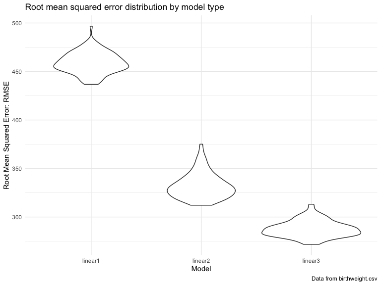

p8105\_hw6\_rac2224
================
Rachel Crowley
11/24/2019

## Problem 1

Loading and cleaning the data for regression analysis

``` r
bwt_data = read_csv("data/birthweight.csv") %>%
  rename(
    baby_sex = babysex,
    baby_head = bhead,
    baby_length = blength,
    birthweight = bwt,
    delivery_weight = delwt,
    family_income = fincome,
    father_race = frace,
    gestational_age = gaweeks,
    malformations = malform,
    menarche_age = menarche,
    mother_height = mheight,
    mother_age = momage, 
    mother_race = mrace,
    previous_low_birthweight = pnumlbw,
    prior_small_for_gestational = pnumsga, 
    pre_pregnancy_bmi = ppbmi,
    pre_pregnancy_weight = ppwt,
    smoking_during_pregnancy = smoken, 
    pregnancy_weight_gain = wtgain
  ) %>%
  mutate(
    baby_sex = as.factor(baby_sex),
    father_race = as.factor(father_race),
    malformations = as.factor(malformations),
    mother_race = as.factor(mother_race) )%>%
  mutate(
    baby_sex = recode(baby_sex, '1' = 'Male', '2' = 'Female'),
    father_race = recode(father_race, '1' = 'White', '2' = 'Black', '3' = 'Asian', '4' = 'Puerto Rican', '8' = 'Other', '9' = 'Unknown'),
    malformations = recode(malformations, '0' = 'Absent', '1' = 'Present'),
    mother_race = recode(mother_race, '1' = 'White', '2' = 'Black', '3' = 'Asian', '4' = 'Puerto Rican', '8' = 'Other')
  ) %>%
  mutate(
    baby_sex = fct_infreq(baby_sex),
    father_race = fct_infreq(father_race),
    malformations = fct_infreq(malformations),
    mother_race = fct_infreq(mother_race)
  )
```

    ## Parsed with column specification:
    ## cols(
    ##   .default = col_double()
    ## )

    ## See spec(...) for full column specifications.

``` r
colSums(is.na(bwt_data))
```

    ##                    baby_sex                   baby_head 
    ##                           0                           0 
    ##                 baby_length                 birthweight 
    ##                           0                           0 
    ##             delivery_weight               family_income 
    ##                           0                           0 
    ##                 father_race             gestational_age 
    ##                           0                           0 
    ##               malformations                menarche_age 
    ##                           0                           0 
    ##               mother_height                  mother_age 
    ##                           0                           0 
    ##                 mother_race                      parity 
    ##                           0                           0 
    ##    previous_low_birthweight prior_small_for_gestational 
    ##                           0                           0 
    ##           pre_pregnancy_bmi        pre_pregnancy_weight 
    ##                           0                           0 
    ##    smoking_during_pregnancy       pregnancy_weight_gain 
    ##                           0                           0

  - baby\_sex, mother\_race, father\_race, and malformations were
    converted from numeric to factor variables. There were no missing
    values across all variables in the dataset.

Building regression models

  - For the proposed regression model for birthweight, the following
    variables were included in the model as predictors, based on
    existing literature that support an associaton between these factors
    and birthweight: average number of cigarettes smoked per day during
    pregnancy (smoking\_during\_pregnancy), mother’s age at delivery in
    years (mother\_age), mother’s pre-pregnancy BMI
    (pre\_pregnancy\_bmi), and gestational age in weeks
    (gestational\_age). It is hypothesized that for an one unit increase
    in the average number of cigarettes smoked per day during pregnancy,
    birthweight will decrease; for an increase in age at delivery in
    years, birthweight will decrease; for a one unit increase in
    mother’s pre-pregnancy BMI, birthweight will increase; for an
    increase in gestational age in weeks, birthweight will increase.

Fitting the model and plot of model residuals against fitted
value

``` r
fit = lm(birthweight ~ smoking_during_pregnancy + mother_age + pre_pregnancy_bmi + gestational_age, data = bwt_data)

summary(fit)$coef
```

    ##                           Estimate  Std. Error    t value      Pr(>|t|)
    ## (Intercept)              52.463522 101.1974025  0.5184276  6.041864e-01
    ## smoking_during_pregnancy -6.750317   0.9461156 -7.1347702  1.130899e-12
    ## mother_age               12.019965   1.8235333  6.5915798  4.872476e-11
    ## pre_pregnancy_bmi        12.266396   2.2029542  5.5681576  2.730017e-08
    ## gestational_age          65.472505   2.2302392 29.3567191 6.016702e-173

``` r
fit %>% 
  broom::tidy() %>%
   knitr::kable(digits = 3)
```

| term                       | estimate | std.error | statistic | p.value |
| :------------------------- | -------: | --------: | --------: | ------: |
| (Intercept)                |   52.464 |   101.197 |     0.518 |   0.604 |
| smoking\_during\_pregnancy |  \-6.750 |     0.946 |   \-7.135 |   0.000 |
| mother\_age                |   12.020 |     1.824 |     6.592 |   0.000 |
| pre\_pregnancy\_bmi        |   12.266 |     2.203 |     5.568 |   0.000 |
| gestational\_age           |   65.473 |     2.230 |    29.357 |   0.000 |

``` r
bwt_data %>%
  modelr::add_residuals(fit) %>%
  modelr::add_predictions(fit) %>%
  ggplot(aes(x = pred, y = resid)) + geom_point() + 
  geom_hline(aes(yintercept = 0)) + 
  labs(
    title = "Modeling residuals for proposed regression model for birthweight",
    y = "Residuals",
    x = "Fitted Values",
    caption = "Data from Birthweight.csv"
  )
```


\*When modeling residuals against fitted values for the proposed
regression model, the residuals are scattered far away from the line
where residuals (y) equals 0, indicating high variance and difference
between observed and predicted values with this model.

Fitting two other models: modeling residuals against fitted values

``` r
fit2 = lm(birthweight ~ baby_length + gestational_age, data = bwt_data)

summary(fit2)$coef
```

    ##                    Estimate Std. Error   t value     Pr(>|t|)
    ## (Intercept)     -4347.66707  97.958360 -44.38281 0.000000e+00
    ## baby_length       128.55569   1.989891  64.60439 0.000000e+00
    ## gestational_age    27.04673   1.717930  15.74379 2.358891e-54

``` r
fit2 %>% 
  broom::tidy() %>%
   knitr::kable(digits = 3)
```

| term             |   estimate | std.error | statistic | p.value |
| :--------------- | ---------: | --------: | --------: | ------: |
| (Intercept)      | \-4347.667 |    97.958 |  \-44.383 |       0 |
| baby\_length     |    128.556 |     1.990 |    64.604 |       0 |
| gestational\_age |     27.047 |     1.718 |    15.744 |       0 |

``` r
bwt_data %>%
  modelr::add_residuals(fit2) %>%
  modelr::add_predictions(fit2) %>%
  ggplot(aes(x = pred, y = resid)) + geom_point() + 
  geom_hline(aes(yintercept = 0)) + 
  labs(
    title = "Modeling residuals for regression model with baby length and gestational age",
    y = "Residuals",
    x = "Fitted Values",
    caption = "Data from Birthweight.csv"
  )
```


``` r
fit3 = lm(birthweight ~ baby_head*baby_length*baby_sex, data = bwt_data)


summary(fit3)$coef
```

    ##                                           Estimate   Std. Error    t value
    ## (Intercept)                          -7176.8170221 1264.8397394 -5.6740920
    ## baby_head                              181.7956350   38.0542051  4.7772811
    ## baby_length                            102.1269235   26.2118095  3.8962180
    ## baby_sexFemale                        6374.8683508 1677.7669213  3.7996150
    ## baby_head:baby_length                   -0.5536096    0.7802092 -0.7095656
    ## baby_head:baby_sexFemale              -198.3931810   51.0916850 -3.8830816
    ## baby_length:baby_sexFemale            -123.7728875   35.1185360 -3.5244319
    ## baby_head:baby_length:baby_sexFemale     3.8780531    1.0566296  3.6702106
    ##                                          Pr(>|t|)
    ## (Intercept)                          1.485151e-08
    ## baby_head                            1.835551e-06
    ## baby_length                          9.918043e-05
    ## baby_sexFemale                       1.469088e-04
    ## baby_head:baby_length                4.780117e-01
    ## baby_head:baby_sexFemale             1.046771e-04
    ## baby_length:baby_sexFemale           4.287772e-04
    ## baby_head:baby_length:baby_sexFemale 2.452669e-04

``` r
fit3 %>% 
  broom::tidy() %>%
   knitr::kable(digits = 3)
```

| term                                    |   estimate | std.error | statistic | p.value |
| :-------------------------------------- | ---------: | --------: | --------: | ------: |
| (Intercept)                             | \-7176.817 |  1264.840 |   \-5.674 |   0.000 |
| baby\_head                              |    181.796 |    38.054 |     4.777 |   0.000 |
| baby\_length                            |    102.127 |    26.212 |     3.896 |   0.000 |
| baby\_sexFemale                         |   6374.868 |  1677.767 |     3.800 |   0.000 |
| baby\_head:baby\_length                 |    \-0.554 |     0.780 |   \-0.710 |   0.478 |
| baby\_head:baby\_sexFemale              |  \-198.393 |    51.092 |   \-3.883 |   0.000 |
| baby\_length:baby\_sexFemale            |  \-123.773 |    35.119 |   \-3.524 |   0.000 |
| baby\_head:baby\_length:baby\_sexFemale |      3.878 |     1.057 |     3.670 |   0.000 |

``` r
bwt_data %>%
  modelr::add_residuals(fit3) %>%
  modelr::add_predictions(fit3) %>%
  ggplot(aes(x = pred, y = resid)) + geom_point() + 
  geom_hline(aes(yintercept = 0)) + 
  labs(
    title = "Modeling residuals for regression model with head size, length, and sex interaction",
    y = "Residuals",
    x = "Fitted Values",
    caption = "Data from Birthweight.csv"
  )
```


  - When modeling residuals against fitted values for the regression
    model with head size, length, and sex interaction and for the
    regression model with baby length and gestational age main effects,
    the residuals are closer to the line where residuals equals zero
    (y=0), indicating less variance with these models compared to the
    proposed model above. These models still have residuals that are far
    away from 0, thus variance is still moderately high with these
    models. The model with baby’s head size, length, and sex interaction
    appears to have the least variance of the three models, as residual
    values are closer to the line and fewer extreme values exist.

Comparing regression models in terms of the cross-validated prediction
error

``` r
cv_df = 
  crossv_mc(bwt_data, 100) %>%
  mutate(
    train = map(train, as_tibble),
    test = map(test, as_tibble) 
  ) %>%
  mutate(
    linear_mod1  = map(train, ~lm(birthweight ~ smoking_during_pregnancy + mother_age + pre_pregnancy_bmi + gestational_age,     data = bwt_data)),
    linear_mod2  = map(train, ~lm(birthweight ~ baby_length + gestational_age, data = bwt_data)),
    linear_mod3  = map(train, ~lm(birthweight ~ baby_head*baby_length*baby_sex, data = bwt_data))) %>% 
  mutate(
    rmse_linear1 = map2_dbl(linear_mod1, test, ~rmse(model = .x, data = .y)),
    rmse_linear2 = map2_dbl(linear_mod2, test, ~rmse(model = .x, data = .y)),
    rmse_linear3 = map2_dbl(linear_mod3, test, ~rmse(model = .x, data = .y))) %>%
  select(starts_with("rmse")) %>%
  pivot_longer(
    everything(),
    names_to = "model",
    values_to = "rmse", 
    names_prefix = "rmse_") %>%
      ggplot(aes(x = model, y = rmse)) + geom_violin() + labs(
        title = "Root mean squared error distribution by model type",
        x = "Model",
        y = "Root Mean Squared Error: RMSE",
        caption = "Data from birthweight.csv"
      )
  
cv_df
```



  - After plotting the prediction error distribution for each of the
    three models, the model with interaction by baby’s head size,
    length, and sex has a higher density at the smallest values of root
    mean squared error and best fit compared to the other models. The
    proposed model has the highest root mean squared error values and
    worst fit, while the model with baby length and gestational age main
    effects has slightly worse fit than the model with interaction
    terms.

## Problem 2

Understanding the distribution of r̂2 and log(β̂0∗β̂1) with simple
linear regression and bootstrapping

Simple linear regression with tmax as the response and tmin as the
predictor, finding beta\_0, beta\_1, log(beta\_0\*beta\_1), and r^2
estimates

``` r
weather_df = 
  rnoaa::meteo_pull_monitors(
    c("USW00094728"),
    var = c("PRCP", "TMIN", "TMAX"), 
    date_min = "2017-01-01",
    date_max = "2017-12-31") %>%
  mutate(
    name = recode(id, USW00094728 = "CentralPark_NY"),
    tmin = tmin / 10,
    tmax = tmax / 10) %>%
  select(name, id, everything())
```

    ## Registered S3 method overwritten by 'crul':
    ##   method                 from
    ##   as.character.form_file httr

    ## Registered S3 method overwritten by 'hoardr':
    ##   method           from
    ##   print.cache_info httr

    ## file path:          /Users/rachelannecrowley/Library/Caches/rnoaa/ghcnd/USW00094728.dly

    ## file last updated:  2019-11-24 20:44:15

    ## file min/max dates: 1869-01-01 / 2019-11-30

``` r
boot_straps = weather_df %>%
  bootstrap(n = 5000) %>%
  mutate(
  linear_models = map(strap, ~lm(tmax~tmin, data = .x)),
  tidy_results = map(linear_models, broom::tidy),
  glance_results = map(linear_models, broom::glance)
  ) %>%
  unnest(tidy_results, glance_results) %>%
  select(estimate, term, r.squared) %>%
  pivot_wider(
    names_from = "term",
    values_from = "estimate"
  ) %>%
  rename(
    beta_0 = `(Intercept)`,
    beta_1 = tmin,
    r_squared = r.squared
  ) %>%
  select(r_squared, beta_0, beta_1) %>%
  mutate(
    log_beta0_x_beta1 = log(beta_0*beta_1)
  )
```

Plotting the distribution of log(beta\_0\*beta\_1) and r^2 estimates,
calculating confidence intervals

``` r
boot_straps %>%
    ggplot(aes(x = log_beta0_x_beta1)) + geom_density() + geom_vline(xintercept = 2.016) + labs(
      title = "Distribution of log(beta0*beta1) estimates from 5000 bootstrap samples",
      x = "log(beta0*beta1)",
      caption = "Data from NOAA weather dataset"
    )
```


``` r
boot_straps %>%
    ggplot(aes(x = r_squared)) + geom_density() + geom_vline(xintercept = .912) + labs(
      title = "Distribution of r-squared estimates from 5000 bootstrap samples",
      x = "R-squared",
      caption = "Data from NOAA weather dataset"
    )
```


Distribution of log(beta\_0\*beta\_1)

  - The distribution of log(beta\_0\*beta\_1) appears to have the form
    of a normal distribution, with the majority of points centered
    around a value of 2.016.

  - The 95% confidence interval for log(beta0xbeta1) is 1.965, 2.058,
    thus we are 95% confident that the true log(beta0xbeta1) lies
    between 1.965 and 2.058.

Distribution of r^2 estimates

  - The majority of r^2 estimates are centered around a r^2 value of
    .912 and the distribution appears approximately normal. The high
    density of values around .912 provides evidence that a large percent
    of the variation in tmax can be explained by tmin.

  - The 95% confidence interval for the r\_squared estimate is 0.893,
    0.927, thus we are 95% confident that the true r\_squared value lies
    between 0.893 and 0.927.
